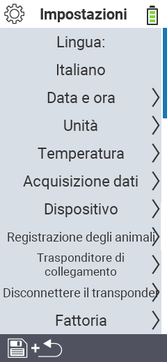

{}
Se clicchi su un elemento del menu, verrai reindirizzato a una descrizione della rispettiva funzione.
{}

<map name="workmap">
  <area shape="rect" coords="2,40,230,120" alt="Lingua" title="Imposta e memorizza permanentemente la lingua dell'interfaccia utente sul tuo dispositivo VitalControl&#10;Clic del mouse: apri la documentazione" href="/it/docs/settings/language/">
  <area shape="rect" coords="2,120,230,160" alt="Data e Ora" title="Qui, imposti la data e l'ora&#10;Clic del mouse: apri la documentazione" href="/it/docs/settings/datetime/">
  <area shape="rect" coords="2,160,230,200" alt="Unità" title="Qui selezioni le unità per temperatura e massa&#10;Clic del mouse: apri la documentazione" href="/it/docs/settings/units/">
  <area shape="rect" coords="2,200,230,240" alt="Temperatura" title="Imposta le impostazioni della temperatura per l'applicazione del tuo dispositivo VitalControl&#10;Clic del mouse: apri la documentazione" href="/it/docs/settings/temperature/">
   <area shape="rect" coords="2,240,230,280" alt="Acquisizione dati" title="Qui memorizzi informazioni rilevanti per la raccolta dei dati sugli animali&#10;Clic del mouse: apri la documentazione" href="/it/docs/settings/data-acquisition/">
   <area shape="rect" coords="2,280,230,320" alt="Dispositivo" title="Qui puoi regolare varie impostazioni del dispositivo&#10;Mausklick: zur Dokumentation" href="/it/docs/settings/device/">
   <area shape="rect" coords="2,320,230,360" alt="Registrazione degli animali" title="Qui puoi regolare diversi standard preimpostati di fabbrica riguardanti la registrazione di nuovi animali alle esigenze della tua azienda agricola.&#10;Clic del mouse: apri la documentazione" href="/it/docs/settings/animal-registration/">
   <area shape="rect" coords="2,360,230,400" alt="Collega transponder" title="Imposta l'assegnazione del transponder sul tuo dispositivo VitalControl&#10;Clic del mouse: apri la documentazione" href="/it/docs/settings/transponder-linkage/">
   <area shape="rect" coords="2,400,230,439" alt="Scollega transponder" title="Specifica come verrà assegnato l'ID dell'animale dopo che il transponder è stato staccato&#10;Clic del mouse: apri la documentazione" href="/it/docs/settings/transponder-linkage/">
   <area shape="rect" coords="2,440,230,480" alt="Azienda agricola" title="Memorizza permanentemente il tuo ID nazionale ufficiale a dodici cifre sul dispositivo VitalControl&#10;Clic del mouse: apri la documentazione" href="/it/docs/settings/farm-number/">
   <area shape="rect" coords="2,482,123,519" alt="Indietro" title="Torna indietro di un livello" href="/it/docs/menu/mainmenu/">
</map>

