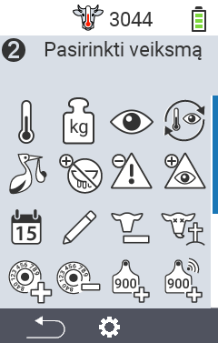
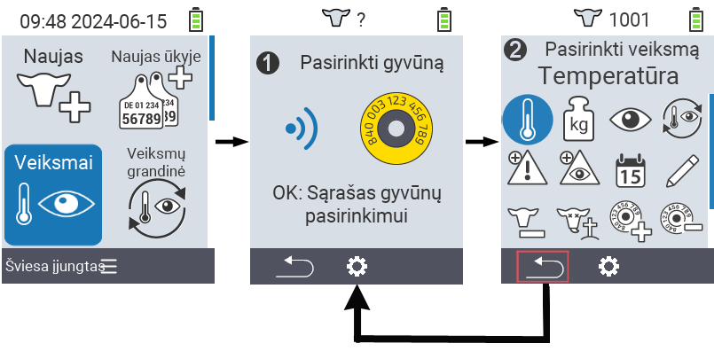
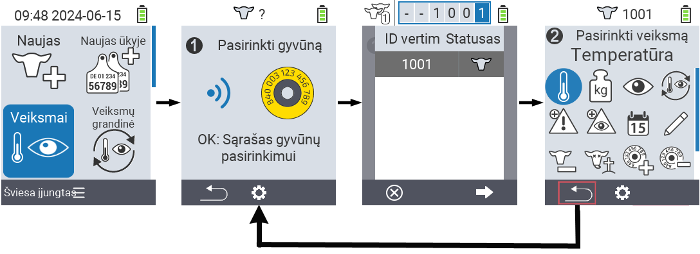

## Galimi veiksmai {#available-actions}

Priklausomai nuo gyvūno tipo, galite atlikti iki 16 skirtingų veiksmų su gyvūnu.

<map name="workmap">
  <area shape="rect" coords="3,100,60,165" alt="Temperatūra" title="Matuokite savo gyvūnų karščiavimą&#10;Pelės paspaudimas: atidaryti dokumentaciją" href="/lt/docs/actions/measure-temperature/">
  <area shape="rect" coords="60,100,118,165" alt="Svoris" title="Įrašykite savo gyvūnų svorį&#10;Pelės paspaudimas: atidaryti dokumentaciją" href="/lt/docs/actions/record-weight/">
  <area shape="rect" coords="118,100,174,165" alt="Vertinimas" title="Įvertinkite savo gyvūnus&#10;Pelės paspaudimas: atidaryti dokumentaciją" href="/lt/docs/actions/rating/">
  <area shape="rect" coords="174,100,230,165" alt="Veiksmų grandinė" title="Taikyti ir nustatyti veiksmų grandinę&#10;Pelės paspaudimas: atidaryti dokumentaciją" href="/lt/docs/chain-of-actions/">
   <area shape="rect" coords="3,165,60,225" alt="Veršiavimasis" title="Registruoti veršiavimąsi&#10;Pelės paspaudimas: atidaryti dokumentaciją" href="/lt/docs/actions/calving/">
   <area shape="rect" coords="60,165,120,225" alt="Sausinimas" title=" Sausinti karvę arba pridėti ją į šviežių karvių sąrašą&#10;Pelės paspaudimas: atidaryti dokumentaciją" href="/lt/docs/actions/dry-off/">
   <area shape="rect" coords="120,165,175,225" alt="Signalizacija" title="Pridėti ir pašalinti gyvūnus iš signalizacijos sąrašo&#10;Pelės paspaudimas: atidaryti dokumentaciją" href="/lt/docs/actions/alarm/">
   <area shape="rect" coords="175,165,230,225" alt="Stebėjimas" title="Pridėti gyvūnus į stebėjimo sąrašą arba pašalinti juos&#10;Pelės paspaudimas: atidaryti dokumentaciją" href="/lt/docs/actions/on-watch/">
   <area shape="rect" coords="3,225,60,280" alt="Gyvūno istorija" title="Peržiūrėti gyvūno istoriją&#10;Pelės paspaudimas: atidaryti dokumentaciją" href="/lt/docs/actions/animal-history/">
   <area shape="rect" coords="60,225,120,280" alt="Redaguoti" title="Redaguoti pasirinkto gyvūno duomenis&#10;Pelės paspaudimas: atidaryti dokumentaciją" href="/lt/docs/actions/edit/">
   <area shape="rect" coords="120,225,175,280" alt="Išregistruoti" title="Išregistruoti gyvūną&#10;Pelės paspaudimas: atidaryti dokumentaciją" href="/lt/docs/actions/unregister/">
   <area shape="rect" coords="175,225,230,280" alt="Gyvūno praradimas" title="Registruoti gyvūno praradimą&#10;Pelės paspaudimas: atidaryti dokumentaciją" href="/lt/docs/actions/animal-loss/">
   <area shape="rect" coords="3,280,60,337" alt="Priskirti transponderį" title="Priskirti transponderį gyvūnui&#10;Pelės paspaudimas: atidaryti dokumentaciją" href="/lt/docs/actions/link-transponder/">
   <area shape="rect" coords="55,280,120,337" alt="Atjungti transponderį" title="Pašalinti transponderio ryšį su gyvūnu&#10;Pelės paspaudimas: atidaryti dokumentaciją" href="/lt/docs/actions/unlink-transponder/">
   <area shape="rect" coords="120,280,175,337" alt="Priskirti gyvūno ID rankiniu būdu" title="Priskirti nacionalinį gyvūno ID gyvūnui, kuris neturi nacionalinio gyvūno ID&#10;Pelės paspaudimas: atidaryti dokumentaciją" href="/lt/docs/actions/link-animal-id/#link-animal-id">
   <area shape="rect" coords="175,280,230,337" alt="Priskirti gyvūno ID su skenavimu" title="Priskirti nacionalinį gyvūno ID gyvūnui, kuris neturi nacionalinio gyvūno ID&#10;Pelės paspaudimas: atidaryti dokumentaciją" href="/lt/docs/actions/link-animal-id/#link-animal-id-with-electronic-ear-tag-scan">

   <area shape="rect" coords="100,340,140,375" alt="Nustatymai" title="Iššaukti nustatymus&#10;Pelės paspaudimas: į dokumentaciją" href="/lt/docs/actions/setting/">
</map>

{}
Kiekvienas veiksmas yra identifikuojamas simboliu. Perkelkite pelės žymeklį ant simbolio žemiau esančioje grafikoje ir palikite jį akimirkai. Pasirodys patarimas, pateikiantis informaciją apie atitinkamą veiksmą. Jei paspausite vieną iš simbolių, būsite nukreipti į atitinkamo veiksmo aprašymą.
{}

## Bendroji procedūra {#general-procedure}

Meniu   `` galite bet kuriuo metu pasirinkti kitą gyvūną, neišeidami iš meniu punkto Veiksmai. Norėdami pasirinkti kitą gyvūną, atlikite šiuos veiksmus:

1. Pasirinkite meniu punktą   `` pagrindiniame jūsų VitalControl įrenginio ekrane ir paspauskite `` mygtuką.

2. Nuskaitykite gyvūną naudodami transponderį arba pasirinkite gyvūną iš sąrašo. Patvirtinkite paspausdami `` ir pasirinkite gyvūną naudodami rodyklių mygtukus △ ▽. Patvirtinkite su ``.

3. Atsidarys submeniu, kuriame rasite daugybę gyvūnų veiksmų piktogramų. Naudokite rodyklių mygtukus norėdami pasirinkti norimą veiksmą ir pradėkite veiksmą paspausdami `` mygtuką. Priklausomai nuo pasirinkto veiksmo, pasirodys vienas ar daugiau ekranų arba iššokantis langas.

4. Jei pageidaujate, dabar galite pasirinkti ir vykdyti kitą veiksmą dabartiniam gyvūnui.

5. Atlikę norimus veiksmus gyvūnui, grįžkite į 2 žingsnį 'Gyvūno pasirinkimas'. Norėdami tai padaryti, paspauskite kairįjį mygtuką `F1` po `` simboliu apatiniame kairiajame kampe.

6. Langas iš antrojo žingsnio vėl atsidarys automatiškai ir galėsite pasirinkti kitą gyvūną arba grįžti į pagrindinį meniu paspausdami `F1` mygtuką po `` simboliu.



{}

{}
{}

{}


