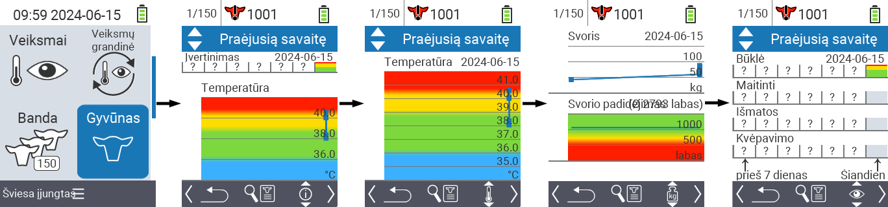
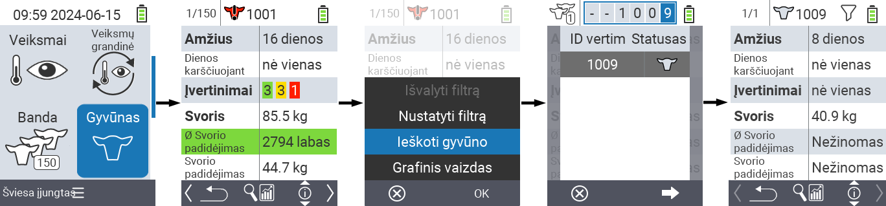
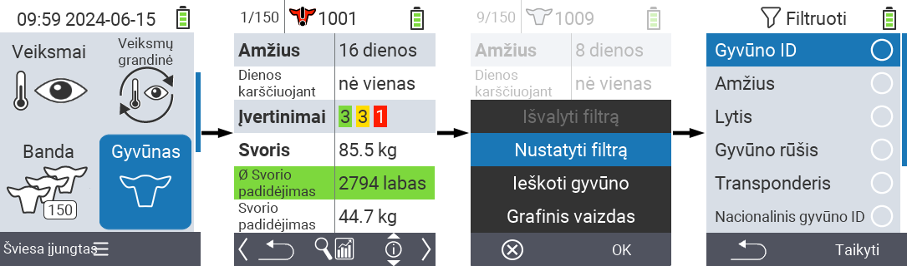

## Gyvūnas {#animal}

Atskira gyvūno funkcija leidžia peržiūrėti svarbią informaciją apie kiekvieno gyvūno svorį, temperatūrą ir įvertinimą. Visada turite galimybę rodyti informaciją kaip grafiką arba kaip sąrašą. Norėdami naudoti atskirą gyvūno funkciją, atlikite šiuos veiksmus:

1. Pagrindiniame savo VitalControl įrenginio ekrane pasirinkite meniu punktą  `` ir paspauskite mygtuką ``.

2. Atsidarys svarbiausios gyvūno informacijos apžvalga. Ekrano viršutinėje dalyje rodoma, kurį gyvūną šiuo metu peržiūrite. Naudokite `F3` klavišą, kad pasirinktumėte tarp gyvūno informacijos , temperatūros , svorio  ir įvertinimo .

{}
Kiekviename informacijos rodinyje turite galimybę [ieškoti gyvūno](#search-animal), nustatyti [filtrą](#set-filter) ir perjungti į [grafinį rodinį](#set-graphical-view).
Taip pat galite bet kada perjungti tarp atskirų gyvūnų naudodami rodyklių klavišus ◁ ▷.
{}

### Nustatyti grafinį rodinį {#set-graphical-view}

1. Paspauskite vidurinį viršutinį `Įjungti/Išjungti` mygtuką  norėdami atidaryti iššokantį meniu. Šiame meniu galite pasirinkti tarp funkcijų ``, `` arba ``.

2. Pasirinkite `` su rodyklių klavišais △ ▽ ir patvirtinkite su ``.

### Ieškoti gyvūno {#search-animal}

1. Paspauskite vidurinį viršutinį `On/Off` mygtuką  norėdami atidaryti iššokantįjį meniu. Šiame meniu galite pasirinkti tarp funkcijų ``, `` arba ``.

2. Pasirinkite `` su rodyklių klavišais △ ▽ ir patvirtinkite su ``.

3. Naudokite rodyklių klavišus △ ▽ ◁ ▷ norėdami pasirinkti norimą gyvūno numerį ir patvirtinkite su ``

### Nustatyti filtrą {#set-filter}

1. Paspauskite vidurinį viršutinį `On/Off` mygtuką  norėdami atidaryti iššokantįjį meniu. Šiame meniu galite pasirinkti tarp funkcijų ``, `` arba ``.

2. Pasirinkite `` su rodyklių klavišais △ ▽ ir patvirtinkite su ``.
Instrukcijas, kaip naudoti filtrą, galite rasti [čia]().

