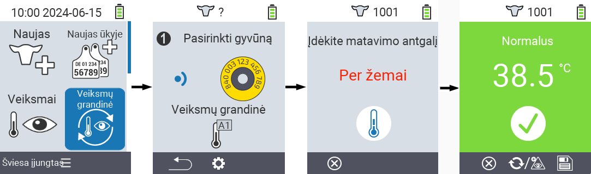
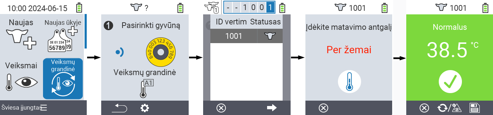
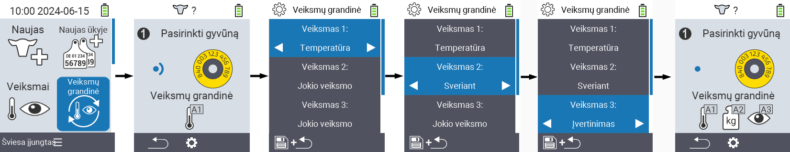

## Veiksmų grandinė {#chain-of-actions}

Veiksmų grandinė leidžia automatiškai atlikti kelis veiksmus gyvūnui vienas po kito. Pavyzdžiui, galite pasirinkti veiksmus `` ir ``. Jei tada atliksite veiksmų grandinę, pirmiausia galite išmatuoti savo gyvūno temperatūrą ir iš karto po to užregistruoti įvertinimą.

### Naudoti veiksmų grandinę {#use-chain-of-actions}

1. Pagrindiniame jūsų VitalControl įrenginio ekrane pasirinkite meniu punktą &nbsp;&nbsp; `` ir paspauskite mygtuką ``.

2. Nuskaitykite gyvūną naudodami transponderį arba patvirtinkite su `` ir naudokite rodyklių klavišus △ ▽ ◁ ▷ norėdami įvesti norimą gyvūno ID.

3. Dabar vykdoma veiksmų grandinė. Kai visi veiksmų grandinės veiksmai bus atlikti, galima tiesiogiai pasirinkti kitą gyvūną.



{}

{}
{}

{}


### Nustatyti veiksmų grandinę {#set-chain-of-actions}

1. Pagrindiniame jūsų VitalControl įrenginio ekrane pasirinkite meniu punktą &nbsp;&nbsp; `` ir paspauskite mygtuką ``.

2. Naudokite mygtuką `F2` &nbsp;&nbsp; (``).

3. Atsiranda perdangos ekranas. Naudokite rodyklių klavišus △ ▽, kad pasirinktumėte tarp išvardytų veiksmų 1 - 4 (galite atlikti iki keturių veiksmų iš eilės). Naudokite rodyklių klavišus ◁ ▷, kad pasirinktumėte norimą veiksmą atitinkamam veiksmui. Išsaugokite nustatymus su `F1` klavišu &nbsp;&nbsp;.

4. Jei norite iš naujo nustatyti visą veiksmų grandinę, pasirinkite parinktį `` submeniu naudodami rodyklių klavišus △ ▽ ir patvirtinkite su ``.

    

{}
Kiekvieno atskiro veiksmo viduje turite tas pačias nustatymo parinktis, kaip aprašyta skyriuje [Veiksmai](../actions) kiekvienam atskiram veiksmui.
{}

{}
Veiksmų grandinės pradžios ekrane esantys simboliai rodo, kokius veiksmus nustatėte ir kokia tvarka.
{}
