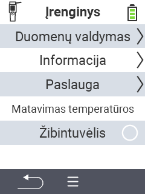

{}
Jei spustelėsite meniu elementą, būsite nukreipti į atitinkamos funkcijos aprašymą.
{}

<map name="workmap">
  <area shape="rect" coords="2,40,238,80" alt="Duomenų valdymas" title="Vykdykite duomenų atsargines kopijas, eksportuokite savo duomenis ir atstatykite įrenginį&#10;Pelės spustelėjimas: atidaryti dokumentaciją" href="/lt/docs/device/data-management/">
  <area shape="rect" coords="2,80,238,120" alt="Informacija" title="Peržiūrėkite svarbią programinės ir techninės įrangos informaciją&#10;Pelės spustelėjimas: atidaryti dokumentaciją" href="/lt/docs/device/info/">
  <area shape="rect" coords="2,120,238,160" alt="Aptarnavimas" title="Patikrinkite savo įrenginio tvarkykles, atnaujinkite programinę įrangą ir atlikite diapazono testą&#10;Pelės spustelėjimas: atidaryti dokumentaciją" href="/lt/docs/device/service/">
  <area shape="rect" coords="2,160,238,200" alt="Temperatūros matavimas" title="Patikrinkite savo įrenginio temperatūros matavimą&#10;Pelės spustelėjimas: atidaryti dokumentaciją" href="/lt/docs/device/temperature-measurement/">
  <area shape="rect" coords="2,200,238,240" alt="Žibintuvėlis" title="Įjunkite arba išjunkite šviesą savo VitalControl įrenginyje&#10;Pelės spustelėjimas: atidaryti dokumentaciją" href="/lt/docs/device/flashlight/">

  <area shape="rect" coords="2,282,97,318" alt="Atgal" title="Grįžti vienu lygiu atgal" href="/lt/docs/menu/mainmenu/">
</map>
