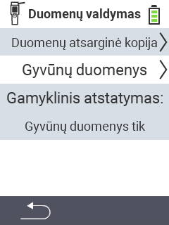

{}
Jei spustelėsite meniu elementą, būsite nukreipti į atitinkamos funkcijos aprašymą.
{}

<map name="workmap">
  <area shape="rect" coords="2,40,238,80" alt="Duomenų atsarginė kopija" title="Instrukcijas, kaip sukurti atsarginę kopiją, rasite čia&#10;Pelės spustelėjimas: atidaryti dokumentaciją" href="/en/docs/device/data-management/data-backup/">

  <area shape="rect" coords="2,80,238,120" alt="Gyvūnų duomenys" title="Instrukcijas, kaip atkurti atsarginę kopiją, rasite čia&#10;Pelės spustelėjimas: atidaryti dokumentaciją" href="/en/docs/device/data-management/animal-data/">

  <area shape="rect" coords="2,120,238,200" alt="Gamyklinis atstatymas" title="Visą informaciją ir instrukcijas, kaip atstatyti įrenginį ir gyvūnų duomenis, rasite čia&#10;Pelės spustelėjimas: atidaryti dokumentaciją" href="/en/docs/reset/">

  <area shape="rect" coords="2,282,120,319" alt="Atgal" title="Visą informaciją ir instrukcijas, kaip eksportuoti gyvūnų duomenis, rasite čia&#10;Pelės spustelėjimas: atidaryti dokumentaciją" href="/en/docs/device/">
</map>
