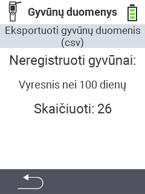

<map name="workmap">
  <area shape="rect" coords="2,40,238,80" alt="Eksportuoti gyvūnų duomenis (csv)" title="Eksportuokite savo gyvūnų duomenis&#10;Pelės paspaudimas: atidaryti dokumentaciją" href="/lt/docs/data-export/usb-drive/">

  <area shape="rect" coords="2,80,238,200" alt="Išregistruoti gyvūnus" title="Nurodykite amžių, nuo kurio gyvūnai turėtų būti išregistruoti&#10;Pelės paspaudimas: atidaryti dokumentaciją" href="/lt/docs/device/data-management/animal-data/unregister-animal/">

  <area shape="rect" coords="2,282,120,319" alt="Atgal" title="Visą informaciją ir instrukcijas apie gyvūnų duomenų eksportą rasite čia&#10;Pelės paspaudimas: atidaryti dokumentaciją" href="/lt/docs/device/data-management/">
</map>
