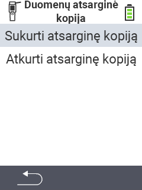

<map name="workmap">
  <area shape="rect" coords="2,40,238,80" alt="Sukurti atsarginę kopiją" title="Instrukcijas, kaip sukurti atsarginę kopiją, rasite čia&#10;Pelės paspaudimas: atidaryti dokumentaciją" href="/lt/docs/backup/backup/">

  <area shape="rect" coords="2,80,238,120" alt="Atkurti atsarginę kopiją" title="Instrukcijas, kaip atkurti atsarginę kopiją, rasite čia&#10;Pelės paspaudimas: atidaryti dokumentaciją" href="/lt/docs/backup/restore/">

  <area shape="rect" coords="2,282,120,319" alt="Atgal" title="Grįžti vienu lygiu atgal&#10;Pelės paspaudimas: atidaryti dokumentaciją" href="/lt/docs/device/data-management/">
</map>
