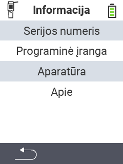

{}
Jei spustelėsite meniu elementą, būsite nukreipti į atitinkamos funkcijos aprašymą.
{}

<map name="workmap">
  <area shape="rect" coords="2,40,238,80" alt="Serijos numeris" title="Norėdami gauti savo įrenginio serijos numerį, spustelėkite čia&#10;Mausklick: zur Dokumentation" href="/lt/docs/device/info/serial-number/">
  <area shape="rect" coords="2,80,238,120" alt="Programinė įranga" title="Instrukcijas, kaip peržiūrėti savo programinės įrangos versiją, rasite čia&#10;Mausklick: zur Dokumentation" href="/lt/docs/firmware/versions/">
  <area shape="rect" coords="2,120,238,160" alt="Techninė įranga" title="Norėdami pasiekti savo įrenginio techninės įrangos informaciją, spustelėkite čia&#10;Mausklick: zur Dokumentation" href="/lt/docs/device/info/hardware/">
  <area shape="rect" coords="2,160,238,200" alt="Apie" title="Iškvieskite tiekėjo informaciją&#10;Mausklick: zur Dokumentation" href="/lt/docs/device/info/about/">

  <area shape="rect" coords="2,282,120,319" alt="Atgal" title="Grįžti į ankstesnį lygį&#10;Mouse click: open documentation" href="/lt/docs/device/">
</map>
