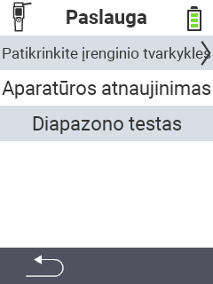

{}
Jei spustelėsite meniu elementą, būsite nukreipti į atitinkamos funkcijos aprašymą.
{}

<map name="workmap">
  <area shape="rect" coords="2,42,238,82" alt="Patikrinkite įrenginio tvarkykles" title="Instrukcijas, kaip patikrinti savo įrenginio tvarkykles, rasite čia&#10;Pelės spustelėjimas: atidaryti dokumentaciją" href="/en/docs/diagnosis/hardware/">
  <area shape="rect" coords="2,82,238,122" alt="Programinės įrangos atnaujinimas" title="Instrukcijas, kaip atnaujinti savo programinę įrangą, rasite čia&#10;Pelės spustelėjimas: atidaryti dokumentaciją" href="/en/docs/firmware/update/">
  <area shape="rect" coords="2,122,238,162" alt="Diapazono testas" title="Instrukcijas, kaip atlikti diapazono testą, rasite čia&#10;Pelės spustelėjimas: atidaryti dokumentaciją" href="/en/docs/diagnosis/rfid-scan/">

  <area shape="rect" coords="2,282,120,319" alt="Atgal" title="Grįžti atgal į lygį&#10;Pelės spustelėjimas: atidaryti dokumentaciją" href="/en/docs/device/">
</map>
