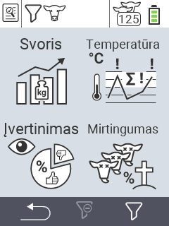

{}
Jei spustelėsite meniu elementą, būsite nukreipti į atitinkamos funkcijos aprašymą.
{}

<map name="workmap">
  <area shape="rect" coords="3,40,116,160" alt="Svoris" title="Įvertinkite savo saugomus duomenis Svorio skyriuje&#10;Pelės spustelėjimas: atidaryti dokumentaciją" href="/en/docs/evaluation/weight/">
  <area shape="rect" coords="3,160,116,279" alt="Įvertinimas" title="Įvertinkite savo saugomus duomenis įvertinimo skyriuje&#10;Pelės spustelėjimas: atidaryti dokumentaciją" href="/en/docs/evaluation/rating/">

  <area shape="rect" coords="116,40,238,160" alt="Temperatūra" title="Įvertinkite savo saugomus duomenis Temperatūros skyriuje&#10;Pelės spustelėjimas: atidaryti dokumentaciją" href="/en/docs/evaluation/temperature/">
  <area shape="rect" coords="116,160,238,279" alt="Mirtingumas" title="Įvertinkite savo saugomus duomenis mirtingumo skyriuje&#10;Pelės spustelėjimas: atidaryti dokumentaciją" href="/en/docs/evaluation/mortality/">

  <area shape="rect" coords="150,282,238,319" alt="Filtras" title="Nustatyti filtrą&#10;Pelės spustelėjimas: į dokumentaciją" href="/en/docs/filter">
  <area shape="rect" coords="2,282,95,319" alt="Atgal" title="Grįžti vienu lygiu atgal&#10;Pelės spustelėjimas: į dokumentaciją" href="/en/docs/menu/mainmenu/">
</map>
