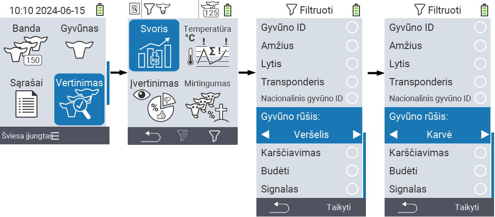
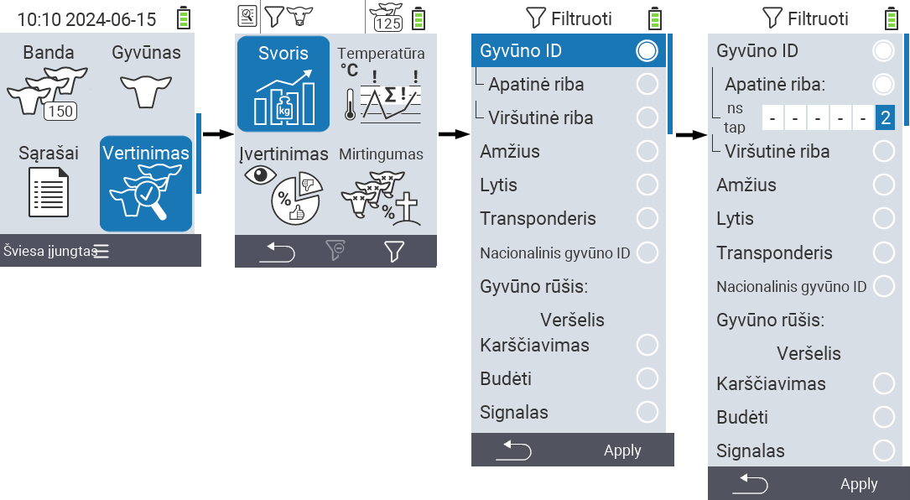
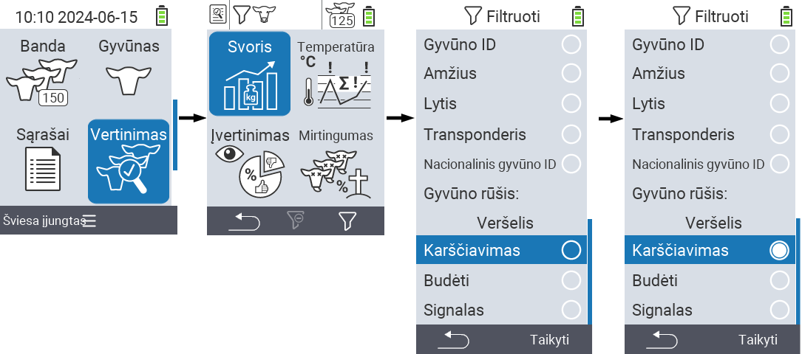

## Filtrų taikymas {#applying-filters}

{}
Filtras padeda atlikti atranką naudojant filtro kriterijus meniu punktuose ``, `` ir `` VitalControl įrenginyje. Kai tik pritaikote filtrą, ekrano viršuje pasirodo įvairių filtro kriterijų simboliai. Šie simboliai padeda sužinoti, ar ir kurie filtro kriterijai yra aktyvuoti. Pavyzdžiui, jei nustatote `` filtrą į vyrišką, įrenginys naudos tik vyriškus gyvūnus. Pavyzdžiui, jei taip pat aktyvuojate `` filtrą, įrenginys naudos tik vyriškus gyvūnus, esančius stebėjimo sąraše.
{}

Norėdami sukurti filtrą vertinimuose, atlikite šiuos veiksmus:

1. Submeniu, priklausančiame viršutiniam meniu punktui  `` paspauskite `F3` klavišą  vieną kartą. Submeniu, priklausančiame viršutiniams meniu punktams  `` ir  ``, turite paspausti klavišą du kartus.

2. Atsidaro submeniu, kuriame galite nustatyti visus filtro nustatymus. Galite filtruoti pagal ``, ``, ``, ``, ``, ``, ``, `` ir ``.

3. Filtrams ``, ``, `` ir `` eikite į atitinkamą sritį ir patvirtinkite su ``. Naudokite rodyklių klavišus ◁ ▷ norėdami nurodyti norimą nustatymą. Naudokite `F3` klavišą `` norėdami įdiegti pasirinktą nustatymą. Norėdami atmesti filtro pakeitimus, paspauskite `F1` klavišą &nbsp;&nbsp;.

4. Filtrams `` ir `` pasirinkite atitinkamą kriterijų ir patvirtinkite su ``. Dabar jums bus parodyta apatinė ir viršutinė riba. Naudokite rodyklių klavišus △ ▽ norėdami pereiti prie norimos ribos ir patvirtinkite paspausdami `` du kartus. Dabar galite nustatyti norimą skaičių naudodami rodyklių klavišus ◁ ▷ ir rodyklių klavišus △ ▽. Kai visi nustatymai yra teisingi, dar kartą paspauskite ``, kad išeitumėte iš nustatymo režimo ir pritaikytumėte pasirinktą filtrą (-us) su `F3` klavišu ``. Naudodami `F1` klavišą &nbsp;&nbsp;, galite atsisakyti savo pakeitimų, jei pageidaujate.

5. Filtrams ``, `` ir `` yra galimybė išjungti arba įjungti jų taikymą. Norėdami tai padaryti, pasirinkite atitinkamą filtrą ir patvirtinkite su ``. Filtras dabar yra aktyvus. Dar kartą patvirtinkite su ``, kad išjungtumėte filtrą.

6. Kai nustatysite visus filtrus, naudokite `F3` klavišą ``, kad įdėtumėte apibrėžtus filtrus arba paspauskite `F1` klavišą  norėdami atsisakyti savo pakeitimų filtrui (-ams).
