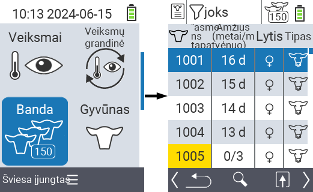
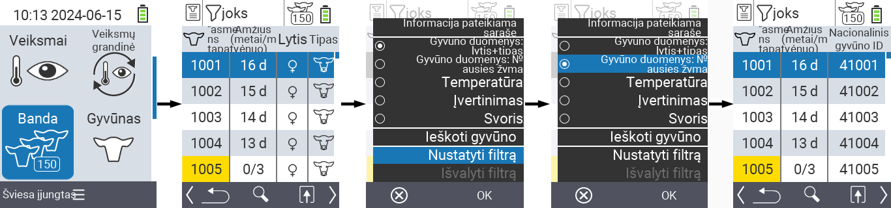
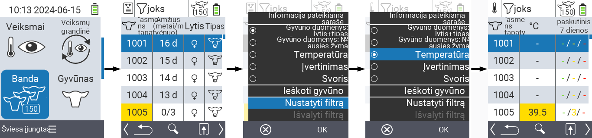
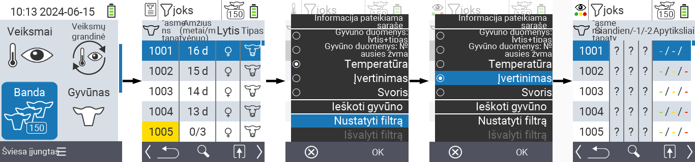
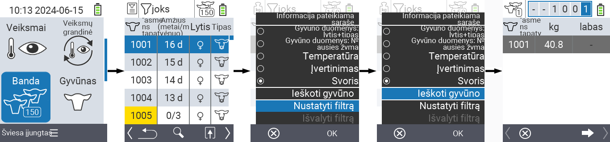
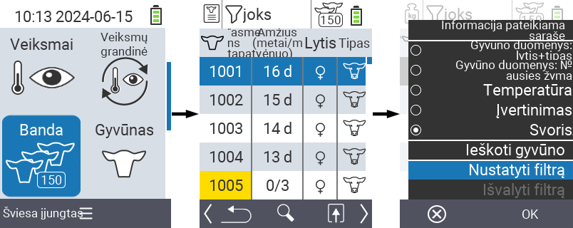
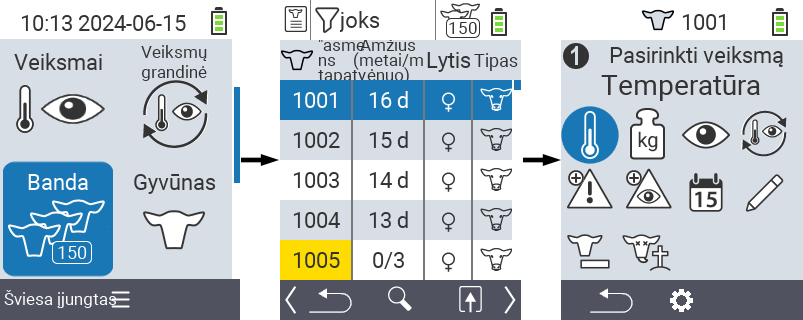

## Banda {#herd}

Bandoje galite peržiūrėti visą savo bandą, ieškoti atskirų gyvūnų ir rodyti svarbią informaciją. Jūs turite šias galimybes:

- Peržiūrėti [gyvūnų duomenis](#view-animal-data)
- Peržiūrėti [temperatūros duomenis](#display-temperature)
- Peržiūrėti [įvertinimo duomenis](#view-rating)
- Peržiūrėti [svorio duomenis](#view-rating)
- [Ieškoti gyvūno](#search-animal)
- Nustatyti [filtrą](#set-filter)
- [Veiksmai](#call-action-menu)

### Parengiamieji žingsniai {#preparatory-steps}

1. Pagrindiniame savo VitalControl įrenginio ekrane pasirinkite meniu punktą  `` ir paspauskite mygtuką ``.

2. Atsidarys jūsų bandos apžvalga.

    

### Peržiūrėti gyvūnų duomenis {#view-animal-data}

1. Atlikite parengiamuosius žingsnius.

2. Naudokite `F3` klavišą &nbsp;&nbsp; norėdami iškviesti iššokantį meniu, kuriame pateikiamos informacijos kategorijos, kurias galima rodyti bandos sąraše. Naudokite rodyklių klavišus △ ▽, kad paryškintumėte eilutę `` arba `` ir pasirinkite šią kategoriją paspausdami centrinį mygtuką `` arba `F3` klavišą ``. Šios dvi pasirinkimo galimybės skiriasi informacijos juostos rodymu.

3. Gyvūnų duomenys dabar bus rodomi kaip bandos sąrašo turinys.

4. Alternatyviai galite naudoti rodyklių klavišus ◁ ▷, kad perjungtumėte skirtingas rodymo parinktis.

    

{}
Pagal numatytuosius nustatymus pirmiausia rodomi gyvūnų duomenys. Tik tada, kai, pavyzdžiui, rodomas svoris, turite iš naujo nustatyti gyvūnų duomenų rodymą.
{}

### Rodyti temperatūrą {#display-temperature}

1. Atlikite parengiamuosius veiksmus.

2. Naudokite `F3` klavišą &nbsp;&nbsp; norėdami iškviesti iššokantįjį meniu, kuriame pateikiamos informacijos kategorijos, kurias galima rodyti bandos sąraše. Naudokite rodyklių klavišus △ ▽, kad paryškintumėte eilutę `` ir pasirinkite šią kategoriją paspausdami centrinį `` mygtuką arba `F3` klavišą ``.

3. Temperatūros duomenys dabar bus rodomi kaip bandos sąrašo turinys.

4. Arba galite naudoti rodyklių klavišus ◁ ▷, kad perjungtumėte skirtingas rodymo parinktis.

    

### Peržiūrėti įvertinimą {#view-rating}

1. Atlikite parengiamuosius veiksmus.

2. Naudokite `F3` klavišą &nbsp;&nbsp; norėdami iškviesti iššokantįjį meniu, kuriame pateikiamos informacijos kategorijos, kurias galima rodyti bandos sąraše. Naudokite rodyklių klavišus △ ▽, kad paryškintumėte eilutę `` ir pasirinkite šią kategoriją paspausdami centrinį `` mygtuką arba `F3` klavišą ``.

3. Įvertinimo duomenys dabar bus rodomi kaip bandos sąrašo turinys.

4. Arba galite naudoti rodyklių klavišus ◁ ▷, kad perjungtumėte skirtingas rodymo parinktis.

    

### Rodyti svorį {#display-weight}

1. Atlikite parengiamuosius veiksmus.

2. Naudokite `F3` klavišą &nbsp;&nbsp; norėdami iškviesti iššokantįjį meniu, kuriame pateikiamos informacijos kategorijos, kurias galima rodyti bandos sąraše. Naudokite rodyklių klavišus △ ▽, kad paryškintumėte eilutę `` ir pasirinkite šią kategoriją paspausdami centrinį `` mygtuką arba `F3` klavišą ``.

3. Svorio duomenys dabar bus rodomi kaip bandos sąrašo turinys.

4. Arba galite naudoti rodyklių klavišus ◁ ▷, kad perjungtumėte skirtingas rodymo parinktis.

    

### Ieškoti gyvūno {#search-animal}

1. Atlikite parengiamuosius veiksmus.

2. Naudokite `F3` klavišą &nbsp;&nbsp; norėdami iškviesti iššokantį meniu, kuriame pateikiamos įvairios parinktys. Naudokite rodyklių klavišus △ ▽, kad paryškintumėte funkciją `` ir iškvieskite paieškos funkciją paspausdami centrinį `` klavišą arba `F3` klavišą ``. Alternatyviai, galite naudoti `Įjungti/Išjungti` mygtuką  iškart po pirmo žingsnio.

3. Naudokite rodyklių klavišus △ ▽ ◁ ▷, kad įvestumėte norimą gyvūno numerį ir patvirtinkite su ``.

    

### Nustatyti filtrą {#set-filter}

1. Atlikite parengiamuosius veiksmus.

2. Naudokite `F3` klavišą &nbsp;&nbsp; norėdami iškviesti iššokantį meniu, kuriame pateikiamos įvairios parinktys. Naudokite rodyklių klavišus △ ▽, kad paryškintumėte funkciją `` ir iškvieskite filtro funkciją paspausdami centrinį `` klavišą arba `F3` klavišą ``.

3. Kaip taikyti filtrą galite rasti [čia]().

    

### Iškvietimo veiksmo meniu {#call-action-menu}

Visada turite galimybę iškviesti veiksmo meniu gyvūnui.

1. Atlikite parengiamuosius veiksmus.

2. Pasirinkite gyvūną iš sąrašo naudodami rodyklių klavišus △ ▽ ir patvirtinkite su ``.

3. Veiksmo meniu dabar atidarytas. Kaip naudoti šį meniu galite rasti [čia](../actions).

4. Grįžkite į bandos sąrašą su `F3` klavišu.

    
