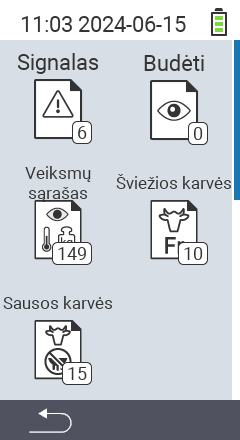

{}
Jei spustelėsite meniu elementą, būsite nukreipti į atitinkamos funkcijos aprašymą.
{}

<map name="workmap">
  <area shape="rect" coords="3,40,116,160" alt="Pavojaus sąrašas" title="Patikrinkite savo pavojaus sąrašą&#10;Pelės spustelėjimas: atidaryti dokumentaciją" href="/lt/docs/lists/alarm/">
  <area shape="rect" coords="3,160,116,280" alt="Veiksmų sąrašas" title="Patikrinkite savo veiksmų sąrašą&#10;Pelės spustelėjimas: atidaryti dokumentaciją" href="/lt/docs/lists/actions/">
  <area shape="rect" coords="3,280,116,399" alt="Sausų karvių sąrašas" title="Patikrinkite savo sausų karvių sąrašą&#10;Pelės spustelėjimas: atidaryti dokumentaciją" href="/lt/docs/lists/dry-cows/">

  <area shape="rect" coords="116,40,230,160" alt="Stebimų sąrašas" title="Patikrinkite savo stebimų sąrašą&#10;Pelės spustelėjimas: atidaryti dokumentaciją" href="/lt/docs/lists/on-watch/">
  <area shape="rect" coords="116,160,230,280" alt="Šviežios karvės" title="Patikrinkite savo šviežių karvių sąrašą&#10;Pelės spustelėjimas: atidaryti dokumentaciją" href="/lt/docs/lists/fresh-cows/">

  <area shape="rect" coords="2,401,115,438" alt="Atgal" title="Grįžti vienu lygiu atgal" href="/lt/docs/menu/mainmenu/">
</map>
