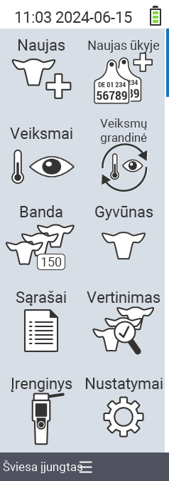

{}
Jei spustelėsite meniu elementą, būsite nukreipti į atitinkamos funkcijos aprašymą.
{}

<map name="workmap">
  <area shape="rect" coords="3,40,116,160" alt="Naujas" title="Sukurti naujus gyvūnus&#10;Pelės paspaudimas: atidaryti dokumentaciją" href="/lt/docs/new/">
  <area shape="rect" coords="3,160,116,280" alt="Veiksmai" title="Veiksmai su gyvūnais&#10;Pelės paspaudimas: atidaryti dokumentaciją" href="/lt/docs/actions/">
  <area shape="rect" coords="3,280,116,400" alt="Banda" title="Bandos meniu&#10;Pelės paspaudimas: atidaryti dokumentaciją" href="/lt/docs/herd/">
  <area shape="rect" coords="3,400,116,520" alt="Sąrašai" title="Gyvūnų sąrašai&#10;Pelės paspaudimas: atidaryti dokumentaciją" href="/lt/docs/lists/">
  <area shape="rect" coords="3,520,116,634" alt="Įrenginys" title="Įrenginys&#10;Pelės paspaudimas: atidaryti dokumentaciją" href="/lt/docs/device/">

  <area shape="rect" coords="116,40,230,160" alt="Naujas ūkyje" title="Gyvūnų prieiga&#10;Pelės paspaudimas: atidaryti dokumentaciją" href="/lt/docs/new-on-farm/">
  <area shape="rect" coords="116,160,230,280" alt="Veiksmų grandinė" title="Veiksmų grandinė&#10;Pelės paspaudimas: atidaryti dokumentaciją" href="/lt/docs/chain-of-actions/">
  <area shape="rect" coords="116,280,230,400" alt="Gyvūnas" title="Gyvūnas&#10;Pelės paspaudimas: atidaryti dokumentaciją" href="/lt/docs/animal/">
  <area shape="rect" coords="116,400,230,520" alt="Vertinimas" title="Vertinimas&#10;Pelės paspaudimas: atidaryti dokumentaciją" href="/lt/docs/evaluation/">
  <area shape="rect" coords="116,520,230,634" alt="Nustatymai" title="Nustatymai&#10;Pelės paspaudimas: atidaryti dokumentaciją" href="/lt/docs/settings/">
</map>
