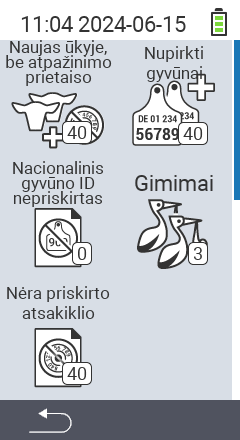

{}
Jei spustelėsite meniu elementą, būsite nukreipti į atitinkamos funkcijos aprašymą.
{}

<map name="workmap">
  <area shape="rect" coords="3,40,116,160" alt="Nauji ūkyje, be transponderio" title="Čia galite priskirti transponderį naujiems gyvūnams be transponderio&#10;Pelės spustelėjimas: atidaryti dokumentaciją" href="/en/docs/new-on-farm/new-no-transponder/">
  <area shape="rect" coords="3,160,116,280" alt="Nėra priskirto nacionalinio gyvūno ID" title="Čia galite peržiūrėti visus gyvūnus, kuriems dar nepriskirtas nacionalinis gyvūno ID, ir priskirti nacionalinį gyvūno ID&#10;Pelės spustelėjimas: atidaryti dokumentaciją" href="/en/docs/new-on-farm/no-national-animal-id-assigned/">
  <area shape="rect" coords="3,280,116,399" alt="Nėra priskirto transponderio" title="Čia galite peržiūrėti visus gyvūnus, kuriems dar nepriskirtas transponderis, ir priskirti jiems transponderį&#10;Pelės spustelėjimas: atidaryti dokumentaciją" href="/en/docs/new-on-farm/no-transponder-assigned/">

  <area shape="rect" coords="116,40,230,160" alt="Įsigyti gyvūnai" title="Čia galite peržiūrėti savo dabartinius pirkinius ir eksportuoti duomenis&#10;Pelės spustelėjimas: atidaryti dokumentaciją" href="/en/docs/new-on-farm/purchased-animals/">
  <area shape="rect" coords="116,160,230,280" alt="Gimimai" title="Čia galite matyti savo gimimus ir sukurti eksporto failą&#10;Pelės spustelėjimas: atidaryti dokumentaciją" href="/en/docs/new-on-farm/births/">
  <area shape="rect" coords="1,401,100,439" alt="Atgal" title="Grįžti vienu lygiu atgal&#10;Pelės spustelėjimas: į dokumentaciją" href="/en/docs/menu/mainmenu/">
</map>
