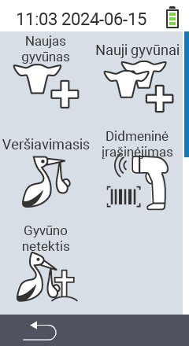

Per pagrindinį meniu punktą  `` pateksite į submeniu, kuriame pateikiami 5 subpunktai pasirinkimui:

<map name="workmap">
  <area shape="rect" coords="3,40,116,160" alt="Naujas gyvūnas" title="Kaip registruoti naują gyvūną naudojant VitalControl įrenginį&#10;Pelės paspaudimas: atidaryti dokumentaciją" href="/en/docs/new/animal/">
  <area shape="rect" coords="3,160,116,280" alt="Veršiavimasis" title="Kaip registruoti naują veršiavimąsi naudojant VitalControl įrenginį&#10;Pelės paspaudimas: atidaryti dokumentaciją" href="/en/docs/new/calving/">
  <area shape="rect" coords="3,280,116,399" alt="Gyvūno praradimas" title="Kaip registruoti gyvūno praradimą naudojant VitalControl įrenginį&#10;Pelės paspaudimas: atidaryti dokumentaciją" href="/en/docs/new/animal-loss/">

  <area shape="rect" coords="116,40,230,160" alt="Nauji gyvūnai" title="Kaip sukurti kelis naujus gyvūnus VitalControl įrenginyje vienu veiksmu&#10;Pelės paspaudimas: atidaryti dokumentaciją" href="/en/docs/new/animals/">
  <area shape="rect" coords="116,160,230,280" alt="Masinis įrašymas" title="Naudokite brūkšninių kodų skaitytuvą, kad įrašytumėte įvairius gyvūnus&#10;Pelės paspaudimas: atidaryti dokumentaciją" href="/en/docs/new/bulk-recording/">

  <area shape="rect" coords="1,401,100,439" alt="Atgal" title="Grįžti vienu lygiu atgal&#10;Pelės paspaudimas: į dokumentaciją" href="/en/docs/menu/mainmenu/">
</map>

{}
Kiekvienas submeniu turi savo piktogramą. Perkelkite pelės žymeklį virš piktogramos aukščiau esančiame grafike ir palikite jį akimirkai. Pasirodys patarimas, rodantis informaciją apie pasirinktą submeniu. Jei spustelėsite vieną iš piktogramų, būsite nukreipti į pasirinkto submeniu punkto aprašymą.
{}

