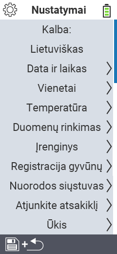

{}
Jei spustelėsite meniu elementą, būsite nukreipti į atitinkamos funkcijos aprašymą.
{}

<map name="workmap">
  <area shape="rect" coords="2,40,230,120" alt="Kalba" title="Nustatykite ir nuolat išsaugokite vartotojo sąsajos kalbą savo VitalControl įrenginyje&#10;Pelės spustelėjimas: atidaryti dokumentaciją" href="/en/docs/settings/language/">
  <area shape="rect" coords="2,120,230,160" alt="Data ir Laikas" title="Čia nustatote datą ir laiką&#10;Pelės spustelėjimas: atidaryti dokumentaciją" href="/en/docs/settings/datetime/">
  <area shape="rect" coords="2,160,230,200" alt="Vienetai" title="Čia pasirenkate temperatūros ir masės vienetus&#10;Pelės spustelėjimas: atidaryti dokumentaciją" href="/en/docs/settings/units/">
  <area shape="rect" coords="2,200,230,240" alt="Temperatūra" title="Nustatykite temperatūros nustatymus savo VitalControl įrenginio taikymui&#10;Pelės spustelėjimas: atidaryti dokumentaciją" href="/en/docs/settings/temperature/">
   <area shape="rect" coords="2,240,230,280" alt="Duomenų rinkimas" title="Čia saugote svarbią informaciją apie gyvūnų duomenų rinkimą&#10;Pelės spustelėjimas: atidaryti dokumentaciją" href="/en/docs/settings/data-acquisition/">
   <area shape="rect" coords="2,280,230,320" alt="Įrenginys" title="Čia galite koreguoti įvairius įrenginio nustatymus&#10;Mausklick: zur Dokumentation" href="/en/docs/settings/device/">
   <area shape="rect" coords="2,320,230,360" alt="Gyvūnų registracija" title="Čia galite koreguoti kelis gamyklinius standartus, susijusius su naujų gyvūnų registracija pagal jūsų ūkio reikalavimus.&#10;Pelės spustelėjimas: atidaryti dokumentaciją" href="/en/docs/settings/animal-registration/">
   <area shape="rect" coords="2,360,230,400" alt="Transponderio susiejimas" title="Nustatykite transponderio priskyrimą savo VitalControl įrenginyje&#10;Pelės spustelėjimas: atidaryti dokumentaciją" href="/en/docs/settings/transponder-linkage/">
   <area shape="rect" coords="2,400,230,439" alt="Transponderio atjungimas" title="Nurodykite, kaip bus priskirtas gyvūno ID po transponderio atjungimo&#10;Pelės spustelėjimas: atidaryti dokumentaciją" href="/en/docs/settings/transponder-linkage/">
   <area shape="rect" coords="2,440,230,480" alt="Ūkis" title="Nuolat išsaugokite savo oficialų dvylikos skaitmenų nacionalinį ūkio ID VitalControl įrenginyje&#10;Pelės spustelėjimas: atidaryti dokumentaciją" href="/en/docs/settings/farm-number/">
   <area shape="rect" coords="2,482,123,519" alt="Atgal" title="Grįžti vienu lygiu atgal" href="/en/docs/menu/mainmenu/">
</map>

Sure, please provide the Markdown content you would like translated into Lithuanian.
