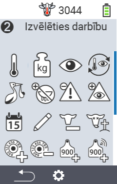
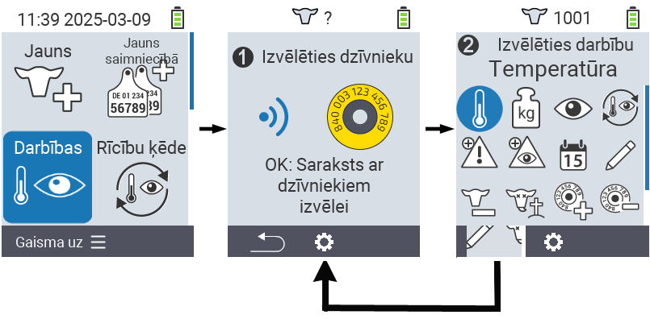
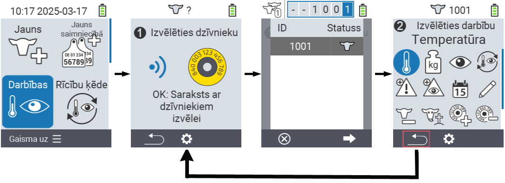

## Pieejamās darbības {#available-actions}

Atkarībā no dzīvnieka veida, jūs varat veikt līdz 16 dažādām darbībām ar dzīvnieku.

<map name="workmap">
  <area shape="rect" coords="3,100,60,165" alt="Temperatūra" title="Mērīt drudzi jūsu dzīvniekiem&#10;Peles klikšķis: atvērt dokumentāciju" href="/lv/docs/actions/measure-temperature/">
  <area shape="rect" coords="60,100,118,165" alt="Svars" title="Reģistrēt jūsu dzīvnieku svaru&#10;Peles klikšķis: atvērt dokumentāciju" href="/lv/docs/actions/record-weight/">
  <area shape="rect" coords="118,100,174,165" alt="Vērtējums" title="Novērtēt jūsu dzīvniekus&#10;Peles klikšķis: atvērt dokumentāciju" href="/lv/docs/actions/rating/">
  <area shape="rect" coords="174,100,230,165" alt="Darbību ķēde" title="Pielietot un iestatīt darbību ķēdi&#10;Peles klikšķis: atvērt dokumentāciju" href="/lv/docs/chain-of-actions/">
   <area shape="rect" coords="3,165,60,225" alt="Teļošana" title="Reģistrēt teļošanu&#10;Peles klikšķis: atvērt dokumentāciju" href="/lv/docs/actions/calving/">
   <area shape="rect" coords="60,165,120,225" alt="Noslaukšana" title="Noslaucīt govi vai pievienot to svaigo govju sarakstam&#10;Peles klikšķis: atvērt dokumentāciju" href="/lv/docs/actions/dry-off/">
   <area shape="rect" coords="120,165,175,225" alt="Trauksme" title="Pievienot un noņemt dzīvniekus no trauksmes saraksta&#10;Peles klikšķis: atvērt dokumentāciju" href="/lv/docs/actions/alarm/">
   <area shape="rect" coords="175,165,230,225" alt="Uzraudzībā" title="Pievienot dzīvniekus uzraudzības sarakstam vai noņemt tos&#10;Peles klikšķis: atvērt dokumentāciju" href="/lv/docs/actions/on-watch/">
   <area shape="rect" coords="3,225,60,280" alt="Dzīvnieka vēsture" title="Apskatīt dzīvnieka vēsturi&#10;Peles klikšķis: atvērt dokumentāciju" href="/lv/docs/actions/animal-history/">
   <area shape="rect" coords="60,225,120,280" alt="Rediģēt" title="Rediģēt izvēlētā dzīvnieka datus&#10;Peles klikšķis: atvērt dokumentāciju" href="/lv/docs/actions/edit/">
   <area shape="rect" coords="120,225,175,280" alt="Atsaukt reģistrāciju" title="Atsaukt dzīvnieka reģistrāciju&#10;Peles klikšķis: atvērt dokumentāciju" href="/lv/docs/actions/unregister/">
   <area shape="rect" coords="175,225,230,280" alt="Dzīvnieka zaudējums" title="Reģistrēt dzīvnieka zaudējumu&#10;Peles klikšķis: atvērt dokumentāciju" href="/lv/docs/actions/animal-loss/">
   <area shape="rect" coords="3,280,60,337" alt="Piesaistīt transponderu" title="Piesaistīt transponderu dzīvniekam&#10;Peles klikšķis: atvērt dokumentāciju" href="/lv/docs/actions/link-transponder/">
   <area shape="rect" coords="55,280,120,337" alt="Atvienot transponderu" title="Noņemt transpondera saiti ar dzīvnieku&#10;Peles klikšķis: atvērt dokumentāciju" href="/lv/docs/actions/unlink-transponder/">
   <area shape="rect" coords="120,280,175,337" alt="Piesaistīt dzīvnieka ID manuāli" title="Piesaistīt nacionālo dzīvnieka ID dzīvniekam, kuram nav nacionālā dzīvnieka ID&#10;Peles klikšķis: atvērt dokumentāciju" href="/lv/docs/actions/link-animal-id/#link-animal-id">
   <area shape="rect" coords="175,280,230,337" alt="Piesaistīt dzīvnieka ID ar skenēšanu" title="Piesaistīt nacionālo dzīvnieka ID dzīvniekam, kuram nav nacionālā dzīvnieka ID&#10;Peles klikšķis: atvērt dokumentāciju" href="/lv/docs/actions/link-animal-id/#link-animal-id-with-electronic-ear-tag-scan">

<area shape="rect" coords="100,340,140,375" alt="Iestatījumi" title="Iestatījumu izsaukšana&#10;Peles klikšķis: uz dokumentāciju" href="/lv/docs/actions/setting/">
</map>

{}
Katra darbība tiek identificēta ar simbolu. Pārvietojiet peles rādītāju virs simbola zemāk esošajā grafikā un ļaujiet tam uz brīdi palikt. Parādīsies uznirstošais padoms, kas sniegs informāciju par attiecīgo darbību. Ja noklikšķināsiet uz kāda no simboliem, jūs tiksiet novirzīts uz attiecīgās darbības aprakstu.
{}

## Vispārējā procedūra {#general-procedure}

Izvēlnē  `` jūs jebkurā laikā varat izvēlēties nākamo dzīvnieku, neatstājot izvēlnes vienumu Darbības. Lai izvēlētos nākamo dzīvnieku, rīkojieties šādi:

1. Izvēlieties izvēlnes vienumu  `` jūsu VitalControl ierīces galvenajā ekrānā un nospiediet `` pogu.

2. Vai nu skenējiet dzīvnieku, izmantojot transponderu, vai izvēlieties dzīvnieku no saraksta. Apstipriniet, nospiežot `` un izvēlieties dzīvnieku, izmantojot bultiņu pogas △ ▽. Apstipriniet ar ``.

3. Atvērsies apakšizvēlne, kurā atradīsiet ikonas daudzām dzīvnieku darbībām. Izmantojiet bultiņu pogas, lai izvēlētos vēlamo darbību un sāktu darbību, nospiežot `` pogu. Atkarībā no izvēlētās darbības parādīsies viens vai vairāki ekrāni vai uznirstošais logs.

4. Ja vēlaties, tagad varat izvēlēties un izpildīt citu darbību pašreizējam dzīvniekam.

5. Pēc tam, kad esat veicis vēlamo darbību(-as) dzīvniekam, atgriezieties pie 2. soļa 'Dzīvnieku izvēle'. Lai to izdarītu, nospiediet kreiso pogu `F1` zem `` simbola apakšējā kreisajā stūrī.

6. Logs no otrā soļa atkal automātiski atvērsies, un jūs varat izvēlēties nākamo dzīvnieku vai atgriezties galvenajā izvēlnē, nospiežot `F1` pogu zem `` simbola.



{}

{}
{}

{}

