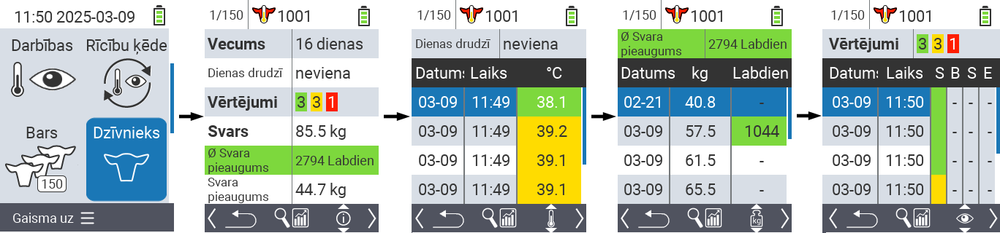
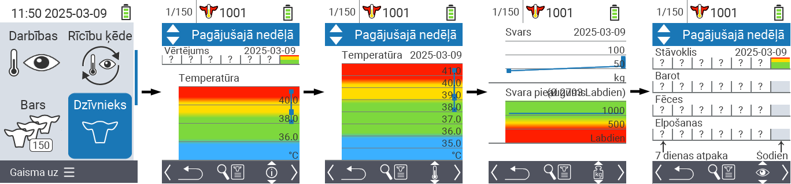
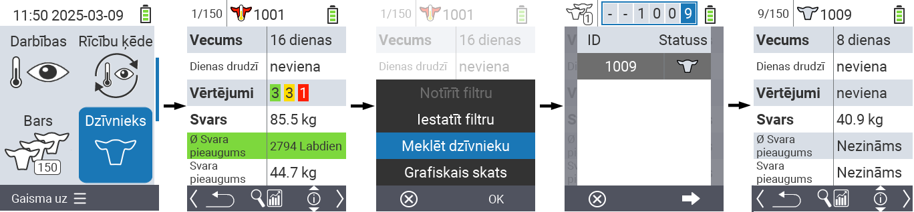
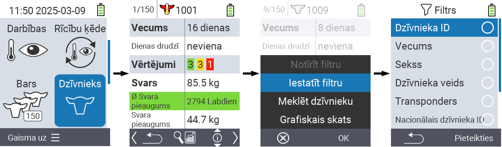

## Dzīvnieks {#animal}

Individuālā dzīvnieka funkcija ļauj skatīt svarīgu informāciju par svaru, temperatūru un vērtējumu katram atsevišķam dzīvniekam. Jums vienmēr ir iespēja parādīt informāciju kā grafiku vai kā sarakstu. Lai izmantotu atsevišķa dzīvnieka funkciju, rīkojieties šādi:

1. Jūsu VitalControl ierīces galvenajā ekrānā izvēlieties izvēlnes vienumu  `` un nospiediet `` pogu.

2. Atveras pārskats par svarīgāko dzīvnieka informāciju. Ekrāna augšējā mala parāda, kuru dzīvnieku pašlaik skatāt. Izmantojiet `F3` taustiņu, lai izvēlētos starp dzīvnieka informāciju , temperatūru , svaru  un vērtējumu .

{}
Katrā informācijas skatā jums ir iespēja [meklēt dzīvnieku](#search-animal), iestatīt [filtru](#set-filter) un pārslēgties uz [grafisko skatu](#set-graphical-view).
Jūs varat arī jebkurā laikā pārslēgties starp atsevišķiem dzīvniekiem, izmantojot bultiņu taustiņus ◁ ▷.
{}

### Iestatīt grafisko skatu {#set-graphical-view}

1. Nospiediet vidējo augšējo `On/Off` pogu , lai atvērtu uznirstošo izvēlni. Šajā izvēlnē jūs varat izvēlēties starp funkcijām ``, `` vai ``.

2. Izvēlieties `` ar bulttaustiņiem △ ▽ un apstipriniet ar ``.

### Meklēt dzīvnieku {#search-animal}

1. Nospiediet vidējo augšējo `On/Off` pogu  lai atvērtu uznirstošo izvēlni. Šajā izvēlnē jūs varat izvēlēties starp funkcijām ``, `` vai ``.

2. Izvēlieties `` ar bulttaustiņiem △ ▽ un apstipriniet ar ``.

3. Izmantojiet bulttaustiņus △ ▽ ◁ ▷, lai izvēlētos vēlamo dzīvnieka numuru un apstipriniet ar ``

### Iestatīt filtru {#set-filter}

1. Nospiediet vidējo augšējo `On/Off` pogu  lai atvērtu uznirstošo izvēlni. Šajā izvēlnē jūs varat izvēlēties starp funkcijām ``, `` vai ``.

2. Izvēlieties `` ar bulttaustiņiem △ ▽ un apstipriniet ar ``.
Instrukcijas par to, kā izmantot filtru, varat iegūt [šeit]().

