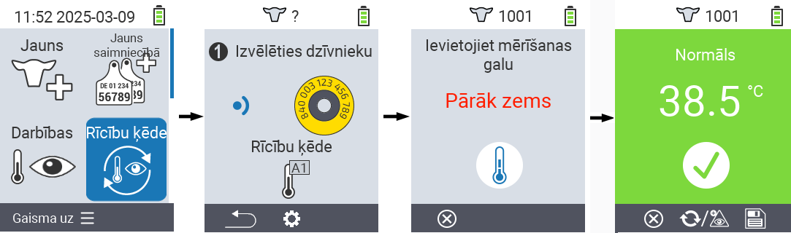
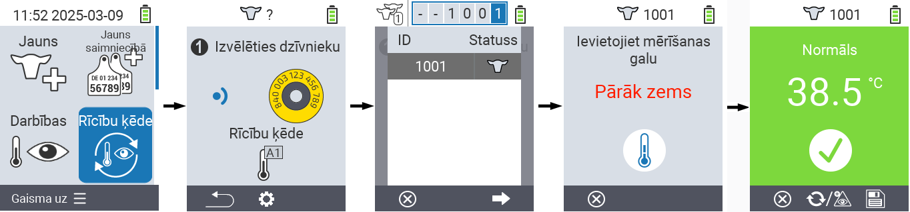

## Darbību ķēde {#chain-of-actions}

Darbību ķēde ļauj automātiski veikt vairākas darbības dzīvniekam vienu pēc otras. Piemēram, jūs varat izvēlēties darbības `` un ``. Ja pēc tam veicat darbību ķēdi, jūs varat vispirms izmērīt dzīvnieka temperatūru un uzreiz pēc tam ierakstīt vērtējumu.

### Lietot darbību ķēdi {#use-chain-of-actions}

1. Jūsu VitalControl ierīces galvenajā ekrānā izvēlieties izvēlnes vienumu &nbsp;&nbsp; `` un nospiediet `` pogu.

2. Vai nu noskenējiet dzīvnieku, izmantojot transponderu, vai apstipriniet ar `` un izmantojiet bulttaustiņus △ ▽ ◁ ▷, lai ievadītu vēlamo dzīvnieka ID.

3. Tagad tiek izpildīta darbību ķēde. Tiklīdz visas darbības darbību ķēdē ir izpildītas, var tieši izvēlēties nākamo dzīvnieku.



{}

{}
{}

{}


### Iestatīt darbību ķēdi {#set-chain-of-actions}

1. Jūsu VitalControl ierīces galvenajā ekrānā izvēlieties izvēlnes vienumu &nbsp;&nbsp; `` un nospiediet `` pogu.

2. Izmantojiet pogu `F2` &nbsp;&nbsp; (``).

3. Parādās pārklājuma ekrāns. Izmantojiet bultiņu taustiņus △ ▽, lai izvēlētos starp uzskaitītajām darbībām 1 - 4 (jūs varat veikt līdz četrām darbībām pēc kārtas). Izmantojiet bultiņu taustiņus ◁ ▷, lai izvēlētos vēlamo darbību attiecīgajai darbībai. Saglabājiet iestatījumus ar taustiņu `F1` &nbsp;&nbsp;.

4. Ja vēlaties atiestatīt visu darbību ķēdi, izvēlieties opciju `` apakšizvēlnē, izmantojot bultiņu taustiņus △ ▽, un apstipriniet ar ``.

   

{}
Individuālajās darbībās jums ir tādas pašas iestatījumu iespējas, kā aprakstīts nodaļā [Darbības](../actions) katrai atsevišķai darbībai.
{}

{}
Darbību ķēdes sākuma ekrānā esošie simboli parāda, kuras darbības esat iestatījis un kādā secībā.
{}
