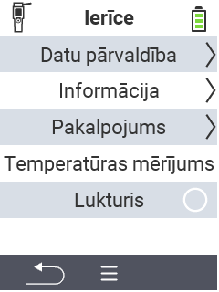

{}
Ja noklikšķināsiet uz izvēlnes vienuma, jūs tiksiet novirzīts uz attiecīgās funkcijas aprakstu.
{}

<map name="workmap">
  <area shape="rect" coords="2,40,238,80" alt="Datu pārvaldība" title="Veiciet datu dublējumus, eksportējiet savus datus un atiestatiet ierīci&#10;Peles klikšķis: atvērt dokumentāciju" href="/en/docs/device/data-management/">
  <area shape="rect" coords="2,80,238,120" alt="Informācija" title="Skatīt svarīgu programmatūras un aparatūras informāciju&#10;Peles klikšķis: atvērt dokumentāciju" href="/en/docs/device/info/">
  <area shape="rect" coords="2,120,238,160" alt="Serviss" title="Pārbaudiet savas ierīces draiverus, atjauniniet programmaparatūru un veiciet diapazona testu&#10;Peles klikšķis: atvērt dokumentāciju" href="/en/docs/device/service/">
  <area shape="rect" coords="2,160,238,200" alt="Temperatūras mērīšana" title="Pārbaudiet savas ierīces temperatūras mērīšanu&#10;Peles klikšķis: atvērt dokumentāciju" href="/en/docs/device/temperature-measurement/">
  <area shape="rect" coords="2,200,238,240" alt="Lukturītis" title="Ieslēdziet vai izslēdziet gaismu savā VitalControl ierīcē&#10;Peles klikšķis: atvērt dokumentāciju" href="/en/docs/device/flashlight/">

  <area shape="rect" coords="2,282,97,318" alt="Atpakaļ" title="Atgriezties vienu līmeni atpakaļ" href="/en/docs/menu/mainmenu/">
</map>
