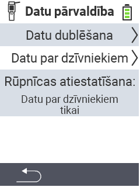

{}
Ja noklikšķināsiet uz izvēlnes vienuma, jūs tiksiet novirzīts uz attiecīgās funkcijas aprakstu.
{}

<map name="workmap">
  <area shape="rect" coords="2,40,238,80" alt="Datu dublēšana" title="Instrukcijas dublējuma izveidei var atrast šeit&#10;Peles klikšķis: atvērt dokumentāciju" href="/lv/docs/device/data-management/data-backup/">

  <area shape="rect" coords="2,80,238,120" alt="Dzīvnieku dati" title="Instrukcijas dublējuma atjaunošanai var atrast šeit&#10;Peles klikšķis: atvērt dokumentāciju" href="/lv/docs/device/data-management/animal-data/">

  <area shape="rect" coords="2,120,238,200" alt="Rūpnīcas atiestatīšana" title="Visu informāciju un instrukcijas ierīces un dzīvnieku datu atiestatīšanai var atrast šeit&#10;Peles klikšķis: atvērt dokumentāciju" href="/lv/docs/reset/">

  <area shape="rect" coords="2,282,120,319" alt="Atpakaļ" title="Visu informāciju un instrukcijas dzīvnieku datu eksportēšanai var atrast šeit&#10;Peles klikšķis: atvērt dokumentāciju" href="/lv/docs/device/">
</map>
