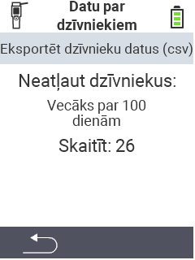

<map name="workmap">
  <area shape="rect" coords="2,40,238,80" alt="Eksportēt dzīvnieku datus (csv)" title="Eksportējiet savus dzīvnieku datus&#10;Noklikšķiniet ar peli: atvērt dokumentāciju" href="/lv/docs/data-export/usb-drive/">

  <area shape="rect" coords="2,80,238,200" alt="Dzīvnieku reģistrācijas atcelšana" title="Norādiet vecumu, no kura dzīvnieki jāizreģistrē&#10;Noklikšķiniet ar peli: atvērt dokumentāciju" href="/lv/docs/device/data-management/animal-data/unregister-animal/">

  <area shape="rect" coords="2,282,120,319" alt="Atpakaļ" title="Visu informāciju un instrukcijas par dzīvnieku datu eksportēšanu var atrast šeit&#10;Noklikšķiniet ar peli: atvērt dokumentāciju" href="/lv/docs/device/data-management/">
</map>
