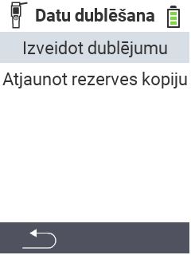

<map name="workmap">
  <area shape="rect" coords="2,40,238,80" alt="Izveidot dublējumu" title="Instrukcijas dublējuma izveidei var atrast šeit&#10;Peles klikšķis: atvērt dokumentāciju" href="/lv/docs/backup/backup/">

  <area shape="rect" coords="2,80,238,120" alt="Atjaunot dublējumu" title="Instrukcijas dublējuma atjaunošanai var atrast šeit&#10;Peles klikšķis: atvērt dokumentāciju" href="/lv/docs/backup/restore/">

  <area shape="rect" coords="2,282,120,319" alt="Atpakaļ" title="Atgriezties vienu līmeni atpakaļ&#10;Peles klikšķis: atvērt dokumentāciju" href="/lv/docs/device/data-management/">
</map>
