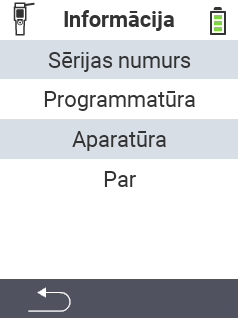

{}
Ja noklikšķināsiet uz izvēlnes vienuma, jūs tiksiet novirzīts uz attiecīgās funkcijas aprakstu.
{}

<map name="workmap">
  <area shape="rect" coords="2,40,238,80" alt="Sērijas numurs" title="Lai iegūtu ierīces sērijas numuru, noklikšķiniet šeit&#10;Mausklick: zur Dokumentation" href="/lv/docs/device/info/serial-number/">
  <area shape="rect" coords="2,80,238,120" alt="Programmatūra" title="Instrukcijas, kā skatīt jūsu programmatūras versiju, var atrast šeit&#10;Mausklick: zur Dokumentation" href="/lv/docs/firmware/versions/">
  <area shape="rect" coords="2,120,238,160" alt="Aparatūra" title="Lai piekļūtu ierīces aparatūras informācijai, noklikšķiniet šeit&#10;Mausklick: zur Dokumentation" href="/lv/docs/device/info/hardware/">
  <area shape="rect" coords="2,160,238,200" alt="Par" title="Atvērt piegādātāja informāciju&#10;Mausklick: zur Dokumentation" href="/lv/docs/device/info/about/">

  <area shape="rect" coords="2,282,120,319" alt="Atpakaļ" title="Atgriezties iepriekšējā līmenī&#10;Mouse click: open documentation" href="/lv/docs/device/">
</map>
