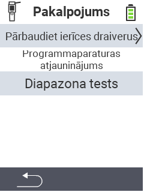

{}
Ja noklikšķināsiet uz izvēlnes vienuma, jūs tiksiet novirzīts uz attiecīgās funkcijas aprakstu.
{}

<map name="workmap">
  <area shape="rect" coords="2,42,238,82" alt="Pārbaudīt ierīču draiverus" title="Instrukcijas, kā pārbaudīt ierīču draiverus, var atrast šeit&#10;Peles klikšķis: atvērt dokumentāciju" href="/lv/docs/diagnosis/hardware/">
  <area shape="rect" coords="2,82,238,122" alt="Programmaparatūras atjaunināšana" title="Instrukcijas, kā atjaunināt programmaparatūru, var atrast šeit&#10;Peles klikšķis: atvērt dokumentāciju" href="/lv/docs/firmware/update/">
  <area shape="rect" coords="2,122,238,162" alt="Darbības pārbaude" title="Instrukcijas, kā veikt darbības pārbaudi, var atrast šeit&#10;Peles klikšķis: atvērt dokumentāciju" href="/lv/docs/diagnosis/rfid-scan/">

  <area shape="rect" coords="2,282,120,319" alt="Atpakaļ" title="Atgriezties līmenī&#10;Peles klikšķis: atvērt dokumentāciju" href="/lv/docs/device/">
</map>
