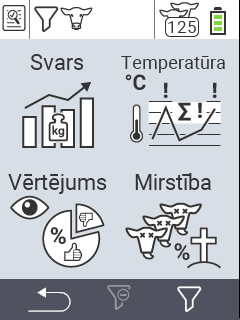

{}
Ja noklikšķināsiet uz izvēlnes vienuma, jūs tiksiet novirzīts uz attiecīgās funkcijas aprakstu.
{}

<map name="workmap">
  <area shape="rect" coords="3,40,116,160" alt="Svars" title="Novērtējiet savus saglabātos datus Svara sadaļā&#10;Peles klikšķis: atvērt dokumentāciju" href="/en/docs/evaluation/weight/">
  <area shape="rect" coords="3,160,116,279" alt="Vērtējums" title="Novērtējiet savus saglabātos datus vērtējuma sadaļā&#10;Peles klikšķis: atvērt dokumentāciju" href="/en/docs/evaluation/rating/">

  <area shape="rect" coords="116,40,238,160" alt="Temperatūra" title="Novērtējiet savus saglabātos datus Temperatūras sadaļā&#10;Peles klikšķis: atvērt dokumentāciju" href="/en/docs/evaluation/temperature/">
  <area shape="rect" coords="116,160,238,279" alt="Mirstība" title="Novērtējiet savus saglabātos datus mirstības sadaļā&#10;Peles klikšķis: atvērt dokumentāciju" href="/en/docs/evaluation/mortality/">

  <area shape="rect" coords="150,282,238,319" alt="Filtrs" title="Iestatīt filtru&#10;Peles klikšķis: uz dokumentāciju" href="/en/docs/filter">
  <area shape="rect" coords="2,282,95,319" alt="Atpakaļ" title="Atgriezties vienu līmeni atpakaļ&#10;Peles klikšķis: uz dokumentāciju" href="/en/docs/menu/mainmenu/">
</map>
