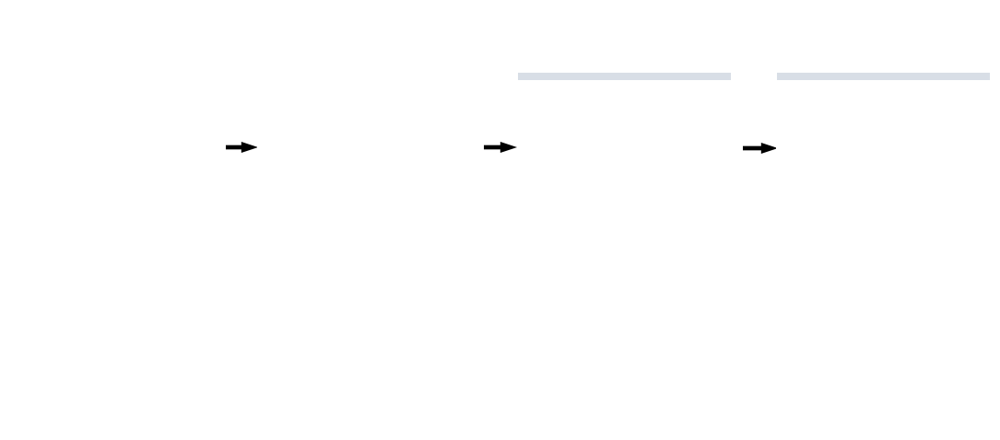
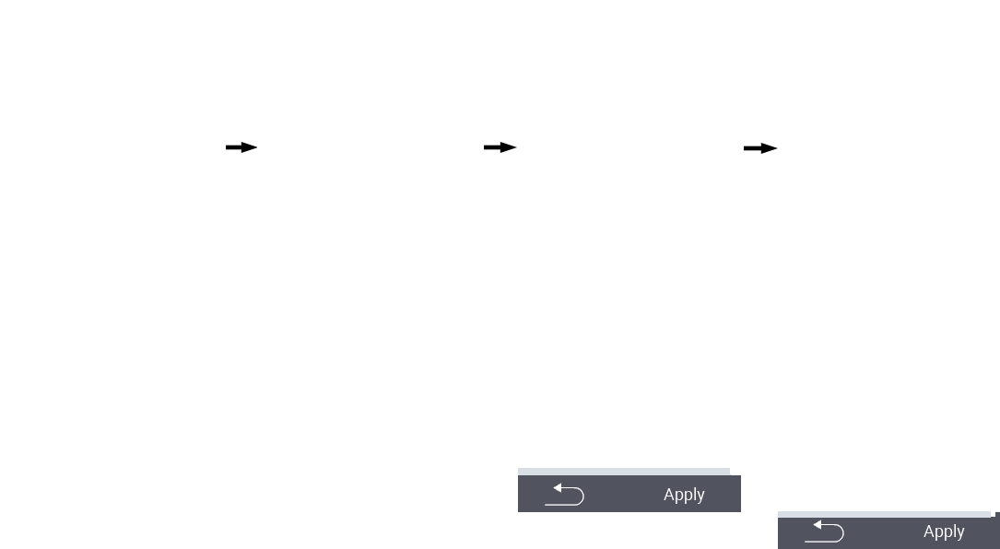

## Filtru piemērošana {#applying-filters}

{}
Filtrs palīdz veikt atlasi, izmantojot filtra kritērijus izvēlnes vienumos ``, `` un `` ierīcē VitalControl. Tiklīdz jūs piemērojat filtru, ekrāna augšpusē parādās simboli dažādiem filtra kritērijiem. Šie simboli palīdz noskaidrot, vai un kuri filtra kritēriji ir aktivizēti. Piemēram, ja jūs iestatāt `` filtru uz vīriešu dzimumu, ierīce izmantos tikai vīriešu dzimuma dzīvniekus. Piemēram, ja jūs arī aktivizējat `` filtru, ierīce izmantos tikai vīriešu dzimuma dzīvniekus, kas ir novērošanas sarakstā.
{}

Lai izveidotu filtru novērtējumos, rīkojieties šādi:

1. Apakšizvēlnē, kas pieder augšējā izvēlnes vienumam  ``, nospiediet `F3` taustiņu  vienu reizi. Apakšizvēlnē, kas pieder augšējā izvēlnes vienumiem  `` un  ``, jums jāspiež taustiņš divreiz.

2. Atveras apakšizvēlne, kurā varat iestatīt visas filtra opcijas. Jūs varat filtrēt pēc ``, ``, ``, ``, ``, ``, ``, `` un ``.

3. Filtriem ``, ``, `` un `` pārvietojieties uz atbilstošo apgabalu un apstipriniet ar ``. Izmantojiet bultiņu taustiņus ◁ ▷, lai norādītu vēlamo iestatījumu. Izmantojiet `F3` taustiņu ``, lai piemērotu izvēlēto iestatījumu. Lai atceltu filtra izmaiņas, nospiediet `F1` taustiņu &nbsp;&nbsp;.

4. Filtriem `` un `` izvēlieties atbilstošo kritēriju un apstipriniet ar ``. Jums tiks parādīta apakšējā un augšējā robeža. Pārvietojieties uz vēlamo robežu, izmantojot bulttaustiņus △ ▽, un apstipriniet, nospiežot `` divreiz. Tagad varat iestatīt vēlamo skaitli, izmantojot bulttaustiņus ◁ ▷ un bulttaustiņus △ ▽. Kad visi iestatījumi ir pareizi, nospiediet `` vēlreiz, lai izietu no iestatījumu režīma un piemērotu izvēlēto filtru(-us) ar `F3` taustiņu ``. Izmantojot `F1` taustiņu &nbsp;&nbsp;, varat atcelt izmaiņas, ja vēlaties.

5. Filtriem ``, `` un `` ir iespēja atspējot vai iespējot to pielietojumu. Lai to izdarītu, izvēlieties atbilstošo filtru un apstipriniet ar ``. Filtrs tagad ir aktīvs. Apstipriniet vēlreiz ar ``, lai deaktivizētu filtru.

6. Kad esat iestatījis visus filtrus, izmantojiet `F3` taustiņu ``, lai piemērotu definētos filtrus, vai nospiediet `F1` taustiņu  lai atceltu izmaiņas filtrā(-os).
