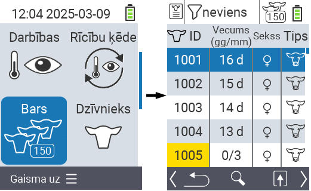
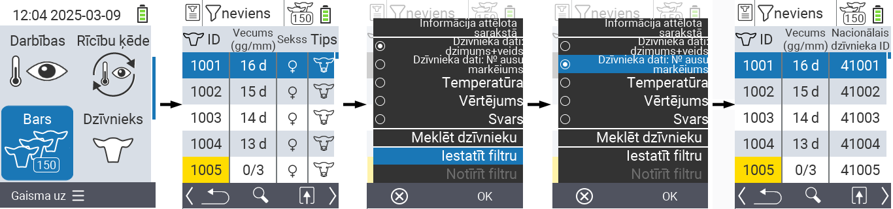
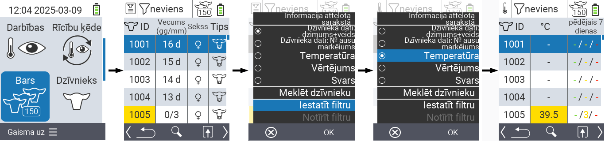
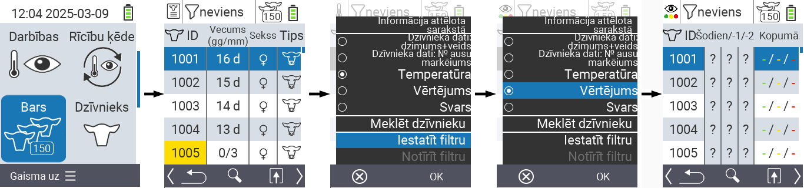
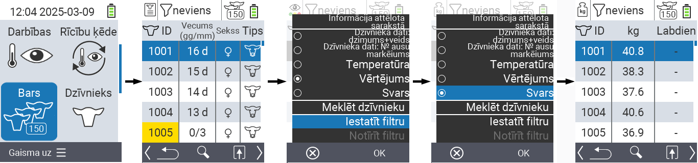
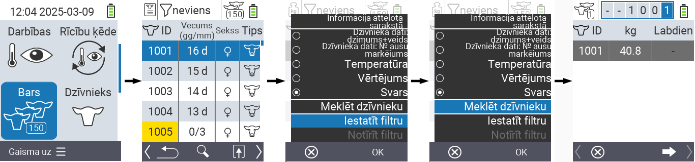
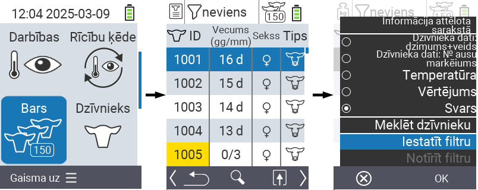
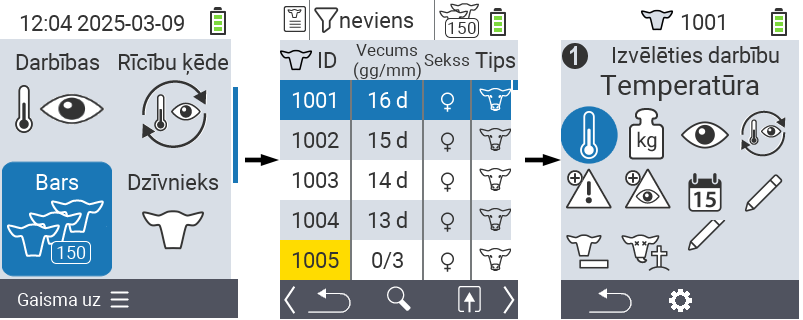

## Ganāmpulks {#herd}

Ganāmpulka izvēlnes vienumā jūs varat apskatīt visu savu ganāmpulku, meklēt atsevišķus dzīvniekus un parādīt svarīgu informāciju. Jums ir šādas iespējas:

- Skatīt [dzīvnieku datus](#view-animal-data)
- Skatīt [temperatūras datus](#display-temperature)
- Skatīt [vērtējuma datus](#view-rating)
- Skatīt [svara datus](#view-rating)
- [Meklēt dzīvnieku](#search-animal)
- Iestatīt [filtru](#set-filter)
- [Darbības](#call-action-menu)

### Sagatavošanās soļi {#preparatory-steps}

1. Jūsu VitalControl ierīces galvenajā ekrānā izvēlieties izvēlnes vienumu  `` un nospiediet `` pogu.

2. Tiek atvērts jūsu ganāmpulka pārskats.

    

### Skatīt dzīvnieku datus {#view-animal-data}

1. Pabeidziet sagatavošanās soļus.

2. Izmantojiet `F3` taustiņu &nbsp;&nbsp; lai izsauktu uznirstošo izvēlni, kas uzskaita informācijas kategorijas, kuras var parādīt ganāmpulka sarakstam. Izmantojiet bultiņu taustiņus △ ▽, lai izceltu līniju `` vai `` un izvēlieties šo kategoriju, nospiežot centrālo `` pogu vai `F3` taustiņu ``. Divas izvēles iespējas atšķiras informācijas joslas attēlojumā.

3. Dzīvnieku dati tagad tiks parādīti kā ganāmpulka saraksta saturs.

4. Alternatīvi, jūs varat izmantot bultiņu taustiņus ◁ ▷, lai pārslēgtos starp dažādām attēlošanas iespējām.

    

{}
Pēc noklusējuma dzīvnieku dati tiek parādīti pirmie. Tikai tad, kad jums ir parādīts, piemēram, svars, jums atkal jāiestata dzīvnieku datu attēlojums.
{}

### Parādīt temperatūru {#display-temperature}

1. Pabeidziet sagatavošanās soļus.

2. Izmantojiet taustiņu `F3` &nbsp;&nbsp;, lai atvērtu uznirstošo izvēlni, kurā uzskaitītas informācijas kategorijas, kuras var parādīt ganāmpulka sarakstam. Izmantojiet bulttaustiņus △ ▽, lai iezīmētu rindu `` un izvēlētos šo kategoriju, nospiežot centrālo `` pogu vai `F3` taustiņu ``.

3. Temperatūras dati tagad tiks parādīti kā ganāmpulka saraksta saturs.

4. Alternatīvi, jūs varat izmantot bulttaustiņus ◁ ▷, lai pārslēgtos starp dažādām attēlošanas opcijām.

    

### Skatīt vērtējumu {#view-rating}

1. Pabeidziet sagatavošanās soļus.

2. Izmantojiet taustiņu `F3` &nbsp;&nbsp;, lai atvērtu uznirstošo izvēlni, kurā uzskaitītas informācijas kategorijas, kuras var parādīt ganāmpulka sarakstam. Izmantojiet bulttaustiņus △ ▽, lai iezīmētu rindu `` un izvēlētos šo kategoriju, nospiežot centrālo `` pogu vai `F3` taustiņu ``.

3. Vērtējuma dati tagad tiks parādīti kā ganāmpulka saraksta saturs.

4. Alternatīvi, jūs varat izmantot bulttaustiņus ◁ ▷, lai pārslēgtos starp dažādām attēlošanas opcijām.

    

### Parādīt svaru {#display-weight}

1. Pabeidziet sagatavošanās soļus.

2. Izmantojiet taustiņu `F3` &nbsp;&nbsp;, lai atvērtu uznirstošo izvēlni, kurā uzskaitītas informācijas kategorijas, kuras var parādīt ganāmpulka sarakstam. Izmantojiet bulttaustiņus △ ▽, lai iezīmētu rindu `` un izvēlētos šo kategoriju, nospiežot centrālo `` pogu vai `F3` taustiņu ``.

3. Svara dati tagad tiks parādīti kā ganāmpulka saraksta saturs.

4. Alternatīvi, jūs varat izmantot bulttaustiņus ◁ ▷, lai pārslēgtos starp dažādām attēlošanas opcijām.

### Meklēt dzīvnieku {#search-animal}

1. Veiciet sagatavošanās soļus.

2. Izmantojiet taustiņu `F3` &nbsp;&nbsp; lai izsauktu uznirstošo izvēlni, kas uzskaita dažādas opcijas. Izmantojiet bulttaustiņus △ ▽, lai iezīmētu funkciju `` un izsauktu meklēšanas funkciju, nospiežot centrālo `` taustiņu vai `F3` taustiņu ``. Alternatīvi, jūs varat izmantot `On/Off` pogu  uzreiz pēc pirmā soļa.

3. Izmantojiet bulttaustiņus △ ▽ ◁ ▷, lai ievadītu vēlamo dzīvnieka numuru un apstiprinātu ar ``.

### Iestatīt filtru {#set-filter}

1. Veiciet sagatavošanās soļus.

2. Izmantojiet taustiņu `F3` &nbsp;&nbsp; lai izsauktu uznirstošo izvēlni, kas uzskaita dažādas opcijas. Izmantojiet bulttaustiņus △ ▽, lai iezīmētu funkciju `` un izsauktu filtra funkciju, nospiežot centrālo `` taustiņu vai `F3` taustiņu ``.

3. Kā piemērot filtru, var atrast [šeit]().

### Izsaukt darbību izvēlni {#call-action-menu}

Jums vienmēr ir iespēja izsaukt darbību izvēlni dzīvniekam.

1. Veiciet sagatavošanās soļus.

2. Izvēlieties dzīvnieku no saraksta ar bulttaustiņiem △ ▽ un apstipriniet ar ``.

3. Darbību izvēlne tagad ir atvērta. Kā to izmantot, var atrast [šeit](../actions).

4. Atgriezieties pie ganāmpulka saraksta ar `F3` taustiņu.

