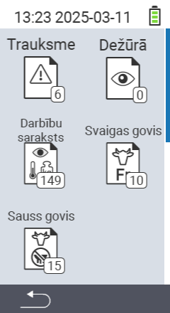

{}
Ja noklikšķināsiet uz izvēlnes vienuma, jūs tiksiet novirzīts uz attiecīgās funkcijas aprakstu.
{}

<map name="workmap">
  <area shape="rect" coords="3,40,116,160" alt="Trauksmes saraksts" title="Pārbaudiet savu trauksmes sarakstu&#10;Peles klikšķis: atvērt dokumentāciju" href="/lv/docs/lists/alarm/">
  <area shape="rect" coords="3,160,116,280" alt="Darbību saraksts" title="Pārbaudiet savu darbību sarakstu.&#10;Peles klikšķis: atvērt dokumentāciju" href="/lv/docs/lists/actions/">
  <area shape="rect" coords="3,280,116,399" alt="Sauso govju saraksts" title="Pārbaudiet savu sauso govju sarakstu&#10;Peles klikšķis: atvērt dokumentāciju" href="/lv/docs/lists/dry-cows/">

  <area shape="rect" coords="116,40,230,160" alt="Novērošanas saraksts" title="Pārbaudiet savu novērošanas sarakstu&#10;Peles klikšķis: atvērt dokumentāciju" href="/lv/docs/lists/on-watch/">
  <area shape="rect" coords="116,160,230,280" alt="Svaigas govis" title="Pārbaudiet savu svaigo govju sarakstu&#10;Peles klikšķis: atvērt dokumentāciju" href="/lv/docs/lists/fresh-cows/">

  <area shape="rect" coords="2,401,115,438" alt="Atpakaļ" title="Atgriezties vienu līmeni atpakaļ" href="/lv/docs/menu/mainmenu/">
</map>
