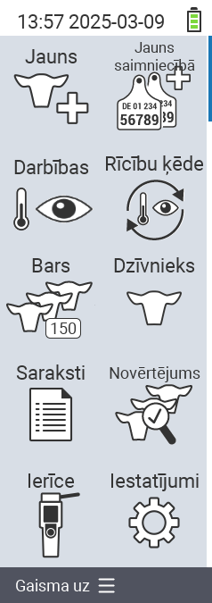

{}
Ja noklikšķināsiet uz izvēlnes vienuma, jūs tiksiet novirzīts uz attiecīgās funkcijas aprakstu.
{}

<map name="workmap">
  <area shape="rect" coords="3,40,116,160" alt="Jauns" title="Izveidot jaunus dzīvniekus&#10;Peles klikšķis: atvērt dokumentāciju" href="/en/docs/new/">
  <area shape="rect" coords="3,160,116,280" alt="Darbības" title="Darbības ar dzīvniekiem&#10;Peles klikšķis: atvērt dokumentāciju" href="/en/docs/actions/">
  <area shape="rect" coords="3,280,116,400" alt="Ganāmpulks" title="Ganāmpulka izvēlne&#10;Peles klikšķis: atvērt dokumentāciju" href="/en/docs/herd/">
  <area shape="rect" coords="3,400,116,520" alt="Saraksti" title="Dzīvnieku saraksti&#10;Peles klikšķis: atvērt dokumentāciju" href="/en/docs/lists/">
  <area shape="rect" coords="3,520,116,634" alt="Ierīce" title="Ierīce&#10;Peles klikšķis: atvērt dokumentāciju" href="/en/docs/device/">

  <area shape="rect" coords="116,40,230,160" alt="Jauns fermā" title="Dzīvnieku piekļuve&#10;Peles klikšķis: atvērt dokumentāciju" href="/en/docs/new-on-farm/">
  <area shape="rect" coords="116,160,230,280" alt="Darbību ķēde" title="Darbību ķēde&#10;Peles klikšķis: atvērt dokumentāciju" href="/en/docs/chain-of-actions/">
  <area shape="rect" coords="116,280,230,400" alt="Dzīvnieks" title="Dzīvnieks&#10;Peles klikšķis: atvērt dokumentāciju" href="/en/docs/animal/">
  <area shape="rect" coords="116,400,230,520" alt="Novērtējums" title="Novērtējums&#10;Peles klikšķis: atvērt dokumentāciju" href="/en/docs/evaluation/">
  <area shape="rect" coords="116,520,230,634" alt="Iestatījumi" title="Iestatījumi&#10;Peles klikšķis: atvērt dokumentāciju" href="/en/docs/settings/">
</map>
