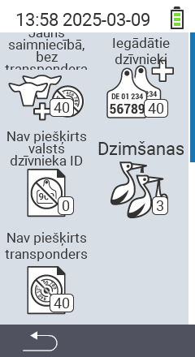

{}
Ja noklikšķināsiet uz izvēlnes vienuma, jūs tiksiet novirzīts uz attiecīgās funkcijas aprakstu.
{}

<map name="workmap">
  <area shape="rect" coords="3,40,116,160" alt="Jauns fermā, bez transpondera" title="Šeit jūs piešķirat transponderu jauniem dzīvniekiem bez transpondera&#10;Peles klikšķis: atvērt dokumentāciju" href="/lv/docs/new-on-farm/new-no-transponder/">
  <area shape="rect" coords="3,160,116,280" alt="Nav piešķirts nacionālais dzīvnieka ID" title="Šeit jūs varat apskatīt visus dzīvniekus, kuriem vēl nav piešķirts nacionālais dzīvnieka ID, un piešķirt nacionālo dzīvnieka ID&#10;Peles klikšķis: atvērt dokumentāciju" href="/lv/docs/new-on-farm/no-national-animal-id-assigned/">
  <area shape="rect" coords="3,280,116,399" alt="Nav piešķirts transponders" title="Šeit jūs varat apskatīt visus dzīvniekus, kuriem vēl nav piešķirts transponders, un piešķirt tiem transponderu&#10;Peles klikšķis: atvērt dokumentāciju" href="/lv/docs/new-on-farm/no-transponder-assigned/">

  <area shape="rect" coords="116,40,230,160" alt="Iegādātie dzīvnieki" title="Šeit jūs varat apskatīt savus pašreizējos pirkumus un eksportēt datus&#10;Peles klikšķis: atvērt dokumentāciju" href="/lv/docs/new-on-farm/purchased-animals/">
  <area shape="rect" coords="116,160,230,280" alt="Dzimšanas" title="Šeit jūs varat redzēt savas dzimšanas un izveidot eksporta failu&#10;Peles klikšķis: atvērt dokumentāciju" href="/lv/docs/new-on-farm/births/">
  <area shape="rect" coords="1,401,100,439" alt="Atpakaļ" title="Atgriezties vienu līmeni atpakaļ&#10;Peles klikšķis: uz dokumentāciju" href="/lv/docs/menu/mainmenu/">
</map>
