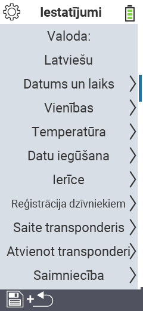

{}
Ja noklikšķināsiet uz izvēlnes vienuma, jūs tiksiet novirzīts uz attiecīgās funkcijas aprakstu.
{}

<map name="workmap">
  <area shape="rect" coords="2,40,230,120" alt="Valoda" title="Iestatiet un pastāvīgi saglabājiet lietotāja saskarnes valodu savā VitalControl ierīcē&#10;Peles klikšķis: atvērt dokumentāciju" href="/lv/docs/settings/language/">
  <area shape="rect" coords="2,120,230,160" alt="Datums un Laiks" title="Šeit jūs iestatāt datumu un laiku&#10;Peles klikšķis: atvērt dokumentāciju" href="/lv/docs/settings/datetime/">
  <area shape="rect" coords="2,160,230,200" alt="Vienības" title="Šeit jūs izvēlaties temperatūras un masas vienības&#10;Peles klikšķis: atvērt dokumentāciju" href="/lv/docs/settings/units/">
  <area shape="rect" coords="2,200,230,240" alt="Temperatūra" title="Iestatiet temperatūras iestatījumus savas VitalControl ierīces lietošanai&#10;Peles klikšķis: atvērt dokumentāciju" href="/lv/docs/settings/temperature/">
   <area shape="rect" coords="2,240,230,280" alt="Datu iegūšana" title="Šeit jūs saglabājat atbilstošu informāciju par dzīvnieku datu vākšanu&#10;Peles klikšķis: atvērt dokumentāciju" href="/lv/docs/settings/data-acquisition/">
   <area shape="rect" coords="2,280,230,320" alt="Ierīce" title="Šeit jūs varat pielāgot dažādus ierīces iestatījumus&#10;Mausklick: zur Dokumentation" href="/lv/docs/settings/device/">
   <area shape="rect" coords="2,320,230,360" alt="Dzīvnieku reģistrācija" title="Šeit jūs varat pielāgot vairākus rūpnīcā iestatītus standartus attiecībā uz jaunu dzīvnieku reģistrāciju atbilstoši jūsu saimniecības prasībām.&#10;Peles klikšķis: atvērt dokumentāciju" href="/lv/docs/settings/animal-registration/">
   <area shape="rect" coords="2,360,230,400" alt="Transpondera saistīšana" title="Iestatiet transpondera piešķiršanu savā VitalControl ierīcē&#10;Peles klikšķis: atvērt dokumentāciju" href="/lv/docs/settings/transponder-linkage/">
   <area shape="rect" coords="2,400,230,439" alt="Transpondera atsaistīšana" title="Norādiet, kā tiks piešķirts dzīvnieka ID pēc transpondera atvienošanas&#10;Peles klikšķis: atvērt dokumentāciju" href="/lv/docs/settings/transponder-linkage/">
   <area shape="rect" coords="2,440,230,480" alt="Saimniecība" title="Pastāvīgi saglabājiet savu oficiālo divpadsmit ciparu nacionālo saimniecības ID uz VitalControl ierīces&#10;Peles klikšķis: atvērt dokumentāciju" href="/lv/docs/settings/farm-number/">
   <area shape="rect" coords="2,482,123,519" alt="Atpakaļ" title="Atgriezties vienu līmeni atpakaļ" href="/lv/docs/menu/mainmenu/">
</map>
