
<a class="btn btn-lg btn-primary me-3 mb-4" href="#td-block-2">
  Learn more <i class="fas fa-arrow-alt-circle-right ms-2"></i>
</a>
<a class="btn btn-lg btn-secondary me-3 mb-4" href="/docs/">
  Documentatie<i class="fa-solid fa-book ms-2 "></i>
</a>

Health management at the highest level!




{}
Goldydocs provides a single web UI providing visibility into porridge
temperature, chair size, and bed softness metrics! You can even find out who's
been eating **your** porridge.

(Sadly, Goldydocs isn't a real project, but you can use this site as an example
to create your own real websites with [Docsy](https://docsy.dev))
{}


{}
 

    

    <button type="button" data-bs-target="#carouselLanguageIndicators" data-bs-slide-to="0" class="active" aria-current="true" aria-label="Duits"></button>
    <button type="button" data-bs-target="#carouselLanguageIndicators" data-bs-slide-to="1" aria-label="Nederlands"></button>
    <button type="button" data-bs-target="#carouselLanguageIndicators" data-bs-slide-to="2" aria-label="Engels"></button>
    <button type="button" data-bs-target="#carouselLanguageIndicators" data-bs-slide-to="3" aria-label="Fins"></button>
    <button type="button" data-bs-target="#carouselLanguageIndicators" data-bs-slide-to="4" aria-label="Frans"></button>
    <button type="button" data-bs-target="#carouselLanguageIndicators" data-bs-slide-to="5" aria-label="Russisch"></button>
    <button type="button" data-bs-target="#carouselLanguageIndicators" data-bs-slide-to="6" aria-label="Spaans"></button>
    <button type="button" data-bs-target="#carouselLanguageIndicators" data-bs-slide-to="7" aria-label="Bosnisch"></button>
    <button type="button" data-bs-target="#carouselLanguageIndicators" data-bs-slide-to="8" aria-label="Bulgaars"></button>
    <button type="button" data-bs-target="#carouselLanguageIndicators" data-bs-slide-to="9" aria-label="Chinees"></button>
    <button type="button" data-bs-target="#carouselLanguageIndicators" data-bs-slide-to="10" aria-label="Tsjechisch"></button>
    <button type="button" data-bs-target="#carouselLanguageIndicators" data-bs-slide-to="11" aria-label="Noors"></button>
    <button type="button" data-bs-target="#carouselLanguageIndicators" data-bs-slide-to="12" aria-label="Grieks"></button>
    <button type="button" data-bs-target="#carouselLanguageIndicators" data-bs-slide-to="13" aria-label="Turks"></button>
    <button type="button" data-bs-target="#carouselLanguageIndicators" data-bs-slide-to="14" aria-label="Oekraïens"></button>
    <button type="button" data-bs-target="#carouselLanguageIndicators" data-bs-slide-to="15" aria-label="Ests"></button>
    
 

    

      

        <h3>Duits</h3>
      

      
    

    

      

        <h3>Nederlands</h3>
      

      
    

    

      

        <h3>Engels</h3>
      

      
    

    

      

        <h3>Fins</h3>
      

      
    

    

      

        <h3>Frans</h3>
      

      
    

    

      

        <h3>Russisch</h3>
      

    
    
  
    

      

        <h3>Spaans</h3>
      

    
    

      

        

          <h3>Bulgaars</h3>
        

      
      

      

        

          <h3>Bulgarian</h3>
        

      
      

      

        

          <h3>Chinees</h3>
        

      
      

      

        

          <h3>Tsjechisch</h3>
        

      
      

      

        

          <h3>Noors</h3>
        

      
      

      

        

          <h3>Grieks</h3>
        

      
      
      
      

        

          <h3>Turks</h3>
        

      
      
 
      

        

          <h3>Oekraïens</h3>
        

      
      
 
      

        

          <h3>Ests</h3>
        

      
      
 
  

  <button class="carousel-control-prev" type="button" data-bs-target="#carouselLanguagesAutoplaying" data-bs-slide="prev" style="left: 0px; top: 37px; height: 320px;">
    
    Previous
  </button>
  <button class="carousel-control-next" type="button" data-bs-target="#carouselLanguagesAutoplaying" data-bs-slide="next" style="right: 0px; top: 37px; height: 320px;">
    
    Next
  </button>

{}

{}
 

    

    <button type="button" data-bs-target="#carouselActionsIndicators" data-bs-slide-to="0" class="active" aria-current="true" aria-label="Temperatuur"></button>
    <button type="button" data-bs-target="#carouselActionsIndicators" data-bs-slide-to="1" aria-label="Weging"></button>
    <button type="button" data-bs-target="#carouselActionsIndicators" data-bs-slide-to="2" aria-label="Beoordeling"></button>
    <button type="button" data-bs-target="#carouselActionsIndicators" data-bs-slide-to="3" aria-label="Opeenvolgende acties"></button>
    <button type="button" data-bs-target="#carouselActionsIndicators" data-bs-slide-to="4" aria-label="Alarm"></button>
    <button type="button" data-bs-target="#carouselActionsIndicators" data-bs-slide-to="5" aria-label="Bekijken"></button>
    <button type="button" data-bs-target="#carouselActionsIndicators" data-bs-slide-to="6" aria-label="Dierhistorie"></button>
    <button type="button" data-bs-target="#carouselActionsIndicators" data-bs-slide-to="7" aria-label="Veranderen"></button>
    <button type="button" data-bs-target="#carouselActionsIndicators" data-bs-slide-to="8" aria-label="Afmelden"></button>
    <button type="button" data-bs-target="#carouselActionsIndicators" data-bs-slide-to="9" aria-label="Dier verloren"></button>
    <button type="button" data-bs-target="#carouselActionsIndicators" data-bs-slide-to="10" aria-label="Link transponder"></button>
    <button type="button" data-bs-target="#carouselActionsIndicators" data-bs-slide-to="11" aria-label="Transponder afnemen"></button>
    <button type="button" data-bs-target="#carouselActionsIndicators" data-bs-slide-to="12" aria-label="Link dier ID"></button>
    <button type="button" data-bs-target="#carouselActionsIndicators" data-bs-slide-to="13" aria-label="Link dier ID"></button>
  

    

      

        <h3>Temperatuur</h3>
      

      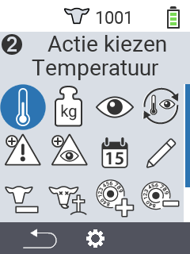
    

    

      

        <h3>Weging</h3>
      

      
    

    

      

        <h3>Beoordeling</h3>
      

      
    

    

      

        <h3>Opeenvolgen. acties</h3>
      

      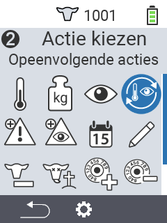
    

    

      

        <h3>Alarm</h3>
      

      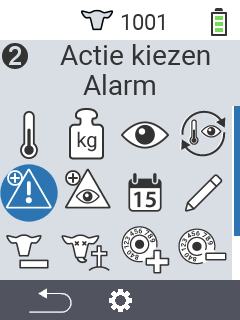
    

    

      

        <h3>Bekijken</h3>
      

      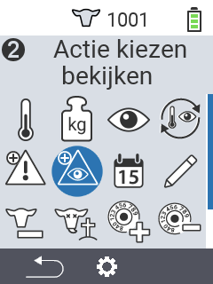
    

    

      

        <h3>Dierhistorie</h3>
      

      
    

    

      

        <h3>Veranderen</h3>
      

      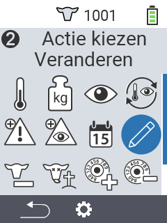
    

    

      

        <h3>Afmelden</h3>
      
      

    

    

      

        <h3>Dier verloren</h3>
      

      
    

    

      

        <h3>Link transponder</h3>
      

      
    

    

      

        <h3>Transponder afnemen</h3>
      

      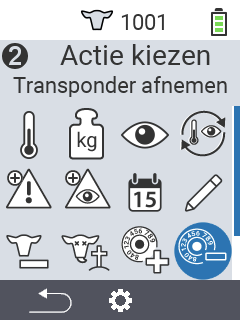
    
      
    

      

        <h3>Link dier ID</h3>
      

      
    
   
    

      

        <h3>Link dier ID</h3>
      

      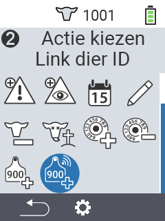
    
             
  

  <button class="carousel-control-prev" type="button" data-bs-target="#carouselActionsAutoplaying" data-bs-slide="prev" style="left: 0px; top: 37px; height: 320px;">
    
    Previous
  </button>
  <button class="carousel-control-next" type="button" data-bs-target="#carouselActionsAutoplaying" data-bs-slide="next" style="right: 0px; top: 37px; height: 320px;">
    
    Next
  </button>

{}

{}
 

    

    <button type="button" data-bs-target="#carouselListsIndicators" data-bs-slide-to="0" class="active" aria-current="true" aria-label="Alarm"></button>
    <button type="button" data-bs-target="#carouselListsIndicators" data-bs-slide-to="1" aria-label="Bekijken"></button>
    <button type="button" data-bs-target="#carouselListsIndicators" data-bs-slide-to="2" aria-label="Actielijst"></button>
    <button type="button" data-bs-target="#carouselListsIndicators" data-bs-slide-to="3" aria-label="Verse koeien"></button>
    <button type="button" data-bs-target="#carouselListsIndicators" data-bs-slide-to="4" aria-label="Droge koeien"></button>
  

    

      

        <h3>Alarm</h3>
      

      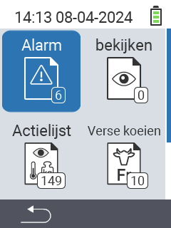
    

    

      

        <h3>Bekijken</h3>
      

      
    

    

      

        <h3>Actielijst</h3>
      
      
      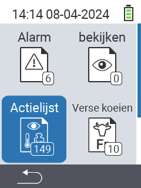
    

    

      

        <h3>Verse koeien</h3>
      

      
    

    

      

        <h3>Droge koeien</h3>
      

    
    

  

  <button class="carousel-control-prev" type="button" data-bs-target="#carouselListsAutoplaying" data-bs-slide="prev" style="left: 0px; top: 37px; height: 320px;">
    
    Previous
  </button>
  <button class="carousel-control-next" type="button" data-bs-target="#carouselListsAutoplaying" data-bs-slide="next" style="right: 0px; top: 37px; height: 320px;">
    
    Next
  </button>

{}

{}
 

    

    <button type="button" data-bs-target="#carouselListsIndicators" data-bs-slide-to="0" class="active" aria-current="true" aria-label="Gewicht"></button>
    <button type="button" data-bs-target="#carouselListsIndicators" data-bs-slide-to="1" aria-label="Temperatuur"></button>
    <button type="button" data-bs-target="#carouselListsIndicators" data-bs-slide-to="2" aria-label="Beoordeling"></button>
    <button type="button" data-bs-target="#carouselListsIndicators" data-bs-slide-to="3" aria-label="Sterfte"></button>
  

    

      

        <h3>Gewicht</h3>
      
 
      
    

    

      

        <h3>Temperatuur</h3>
      
 
      
    

    

      

        <h3>Beoordeling</h3>
      
 
      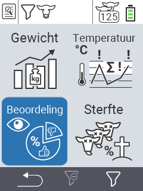
    

    

      

        <h3>Sterfte</h3>
      
 
      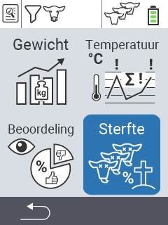
    

  

  <button class="carousel-control-prev" type="button" data-bs-target="#carouselEvaluationAutoplaying" data-bs-slide="prev" style="left: 0px; top: 37px; height: 320px;">
    
    Previous
  </button>
  <button class="carousel-control-next" type="button" data-bs-target="#carouselEvaluationAutoplaying" data-bs-slide="next" style="right: 0px; top: 37px; height: 320px;">
    
    Next
  </button>

{}


{}
{}
For announcement of latest features etc.
{}

{}

{}
This is the second section
{.h1 .text-center}
{}

{}

{}
Get the Goldydocs app!
{}

{}
We do a [Pull Request](https://github.com/google/docsy-example/pulls)
contributions workflow on **GitHub**. New users are always welcome!
{}

{}
For announcement of latest features etc.
{}

{}

{}
This is the another section
{.h1 .text-center}
{}
