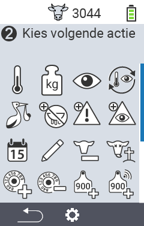
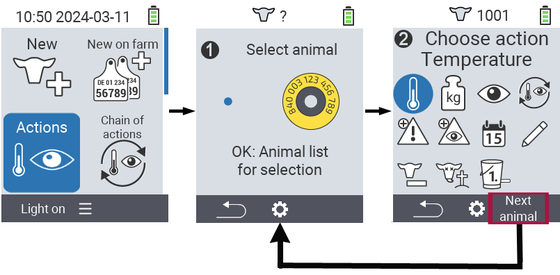

## Available actions

Depending on the animal type, you can perform up to 16 different actions for an animal.

<map name="workmap">
  <area shape="rect" coords="3,100,60,165" alt="Temperatuur" title="Measure fever in your animals&#10;Mouse click: open documentation" href="/nl/docs/actions/measure-temperature/">
  <area shape="rect" coords="60,100,118,165" alt="Weging" title="Record the weight of your animals&#10;Mouse click: open documentation" href="/nl/docs/actions/record-weight/">
  <area shape="rect" coords="118,100,174,165" alt="Beoordeling" title="Rate your animals&#10;Mouse click: open documentation" href="/nl/docs/actions/rating/">
  <area shape="rect" coords="174,100,230,165" alt="Vervolgacties" title="Applying and setting the chain of action&#10;Mouse click: open documentation" href="/nl/docs/chain-of-actions/">
   <area shape="rect" coords="3,165,60,225" alt="Kalving" title="Register a calving&#10;Mouse click: open documentation" href="/nl/docs/actions/calving/">
   <area shape="rect" coords="60,165,120,225" alt="Droog zetten" title=" Dry off a cow or add her to the fresh cows list&#10;Mouse click: open documentation" href="/nl/docs/actions/dry-off/">
   <area shape="rect" coords="120,165,175,225" alt="Alarm" title="Add and remove animals from the alarm list&#10;Mouse click: open documentation" href="/nl/docs/actions/alarm/">
   <area shape="rect" coords="175,165,230,225" alt="bekijken" title="Put animals on the on-watch list or remove them&#10;Mouse click: open documentation" href="/nl/docs/actions/on-watch/">
   <area shape="rect" coords="3,225,60,280" alt="Dierhistorie" title="View an animal’s history&#10;Mouse click: open documentation" href="/nl/docs/actions/animal-history/">
   <area shape="rect" coords="60,225,120,280" alt="Veranderen" title="Edit data of the selected animal&#10;Mouse click: open documentation" href="/nl/docs/actions/edit/">
   <area shape="rect" coords="120,225,175,280" alt="Afmelden" title="Unregister an animal&#10;Mouse click: open documentation" href="/nl/docs/actions/unregister/">
   <area shape="rect" coords="175,225,230,280" alt="Animal loss" title="Register an animal loss&#10;Mouse click: open documentation" href="/nl/docs/actions/animal-loss/">
   <area shape="rect" coords="3,280,60,337" alt="Dier verloren" title="Assign a transponder to an animal&#10;Mouse click: open documentation" href="/nl/docs/actions/link-transponder/">
   <area shape="rect" coords="55,280,120,337" alt="Transponder afnemen" title="Remove the transponder link to an animal&#10;Mouse click: open documentation" href="/nl/docs/actions/unlink-transponder/">
   <area shape="rect" coords="120,280,175,337" alt="Link dier ID manueel" title="Assign a national animal ID to an animal that does not have a national animal ID&#10;Mouse click: open documentation" href="/nl/docs/actions/link-animal-id/#link-animal-id">
   <area shape="rect" coords="175,280,230,337" alt="Link dier ID with scan" title="Assign a national animal ID to an animal that does not have a national animal ID&#10;Mouse click: open documentation" href="/nl/docs/actions/link-animal-id/#link-animal-id-with-electronic-ear-tag-scan">

   <area shape="rect" coords="2,340,100,375" alt="Back" title="Jump back one level" href="/nl/docs/menu/mainmenu/">
   <area shape="rect" coords="100,340,140,375" alt="Instellingen" title="Call up the settings&#10;Mouse click: to the documentation" href="/nl/docs/actions/settings/#menuonderdelen">

</map>

{}
Each action is identified by a symbol. Move the mouse pointer over a symbol in the graphic below and let it rest for a moment. A tooltip appears, presenting information about the respective action. If you click on one of the symbols, you will be forwarded to a description of the respective action.
{}

## General procedure

Within the menu   `Acties` you can select the next animal at any time without having to leave the menu item Actions. To select the next animal, proceed as follows:

1. Select the menu item   `Acties` on the main screen of your VitalControl device and press the `OK` button.

2. Either scan an animal using the transponder or select an animal from the list. Confirm by pressing `OK` and select an animal using the arrow buttons △ ▽. Confirm with `OK`.

3. A submenu with the animal actions opens. In the lower operating bar, you will find the menu item `Next animal`. Use the `F3` button to execute this.

4. The window from step two opens again automatically and you can select the next animal.



{}

{}
{}

{}

