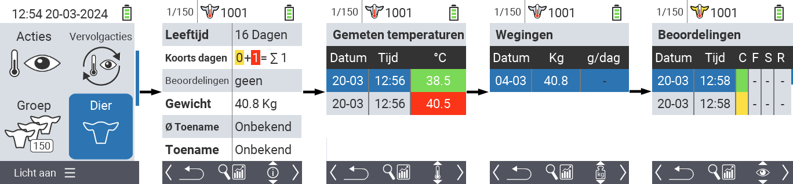
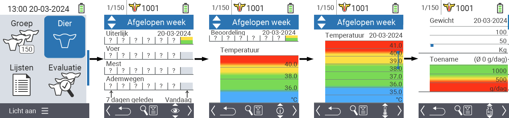
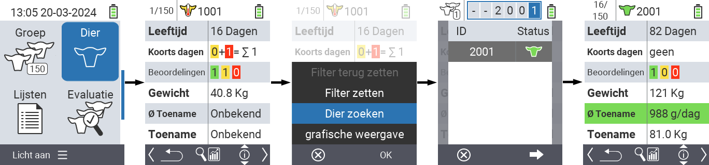
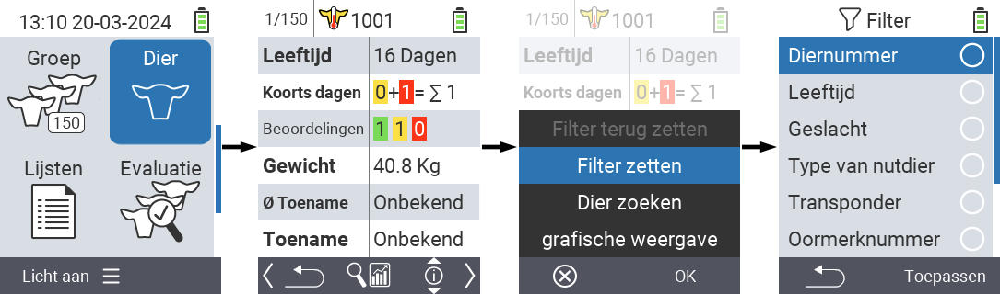

## Dier

De functie voor individuele dieren stelt u in staat belangrijke informatie te bekijken over gewicht, temperatuur en beoordeling voor elk individueel dier. U heeft altijd de optie om de informatie weer te geven als een grafiek of als een lijst. Om de functie voor een enkel dier te gebruiken, ga als volgt te werk:

1. Op het hoofdscherm van uw VitalControl-apparaat, selecteer het menu-item  `Dier` en druk op de `OK` knop.

2. Een overzicht van de belangrijkste dierinformatie opent. De bovenrand van het scherm laat zien welk dier u momenteel bekijkt. Gebruik de `F3` toets om te kiezen tussen dierinformatie , temperatuur , gewicht   en beoordeling .

 

{}
Binnen elke informatieweergave heeft u de optie om [naar een dier te zoeken](#search-animal), een [filter in te stellen](#set-filter) en over te schakelen naar een [grafische weergave](#set-graphical-view).
U kunt ook op elk moment tussen de individuele dieren schakelen met de pijltoetsen ◁ ▷.
{}

### Grafische weergave instellen

1. Druk op de middelste bovenste `Aan/Uit` knop  om een pop-upmenu te openen. In dit menu kunt u kiezen tussen de functies `Filter zetten`, `Dier zoeken`, of `grafische weergave`.

2. Selecteer `grafische weergave` met de pijltoetsen △ ▽ en bevestig met `OK`.

 

### Dier zoeken

1. Druk op de middelste bovenste `Aan/Uit` knop  om een pop-upmenu te openen. In dit menu kunt u kiezen tussen de functies `Filter zetten`, `Dier zoeken`, of `grafische weergave`.

2. Selecteer `Dier zoeken` met de pijltoetsen △ ▽ en bevestig met `OK`.

3. Gebruik de pijltoetsen △ ▽ ◁ ▷ om het gewenste dier nummer te selecteren en bevestig met `OK`

 

### Filter instellen

1. Druk op de middelste bovenste `Aan/Uit` knop  om een pop-upmenu te openen. In dit menu kunt u kiezen tussen de functies `Filter zetten`, `Dier zoeken`, of `grafische weergave`.

2. Selecteer `Filter zetten` met de pijltoetsen △ ▽ en bevestig met `OK`.
U kunt instructies over hoe het filter te gebruiken [hier]() vinden.

 
