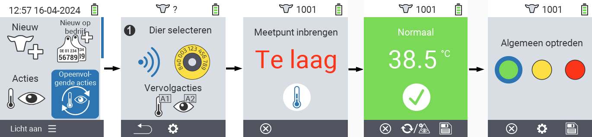
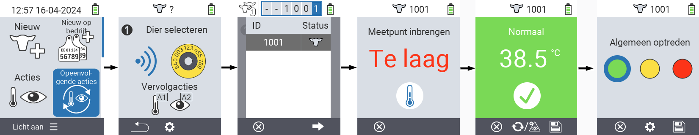
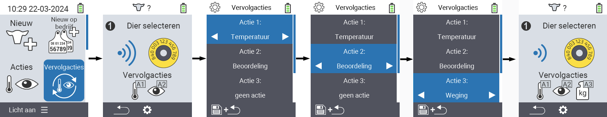

## Chain of actions

The action chain allows you to automatically carry out several actions for an animal one after the other. For example, you can select the actions `Temperatuur` and `Beoordeling`. If you then carry out the chain of actions, you can take your animal's temperature first and record the rating immediately afterwards.

### Use chain of actions

1. On the main screen of your VitalControl device, select the menu item &nbsp;&nbsp; `Vervolgacties` and press the `OK` button.

2. Either scan an animal using the transponder or confirm with `OK` and use the arrow keys △ ▽ ◁ ▷ to enter the desired animal ID.

3. The chain of actions is now executed. As soon as all actions in the action chain have been carried out, the next animal can be selected directly.



{}
 
{}
{}
 
{}


### Set chain of actions

1. On the main screen of your VitalControl device, select the menu item &nbsp;&nbsp; `Vervolgacties` and press the `OK` button.

2. Use the button `F2` &nbsp;&nbsp; (`Instellingen`).

3. An overlay screen pops up. Use the arrow keys △ ▽ to choose between the listed actions 1 - 4 (you can perform up to four actions in a row). Use the arrow keys ◁ ▷ to select the desired action for the respective action. Save the settings with the `F1` key &nbsp;&nbsp;.

4. If you want to reset the entire action chain, select the option `Reset acties` in the submenu using the arrow keys △ ▽ and confirm with `OK`.

    

{}
Within the individual actions you have the same setting options as described in the chapter [Actions](../actions) for each individual action.
{}

{}
The symbols in the start screen of the action chain show which actions you have set and in which order.
{}