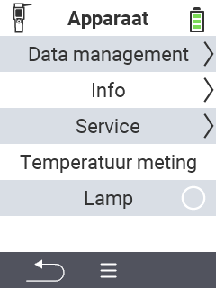

{}
Als u op een menu-item klikt, wordt u doorgestuurd naar een beschrijving van de respectievelijke functie.
{}

<map name="workmap">
  <area shape="rect" coords="2,40,238,80" alt="Gegevensbeheer" title="Voer gegevensback-ups uit, exporteer uw gegevens en reset het apparaat&#10;Muisklik: open documentatie" href="/nl/docs/device/data-management/">
  <area shape="rect" coords="2,80,238,120" alt="Info" title="Bekijk belangrijke software- en hardware-informatie&#10;Muisklik: open documentatie" href="/nl/docs/device/info/">
  <area shape="rect" coords="2,120,238,160" alt="Service" title="Controleer uw apparaatdrivers, update uw firmware en voer een bereiktest uit&#10;Muisklik: open documentatie" href="/nl/docs/device/service/">
  <area shape="rect" coords="2,160,238,200" alt="Temperatuurmeting" title="Test de temperatuurmeting van uw apparaat&#10;Muisklik: open documentatie" href="/nl/docs/device/temperature-measurement/">
  <area shape="rect" coords="2,200,238,240" alt="Lamp" title="Zet het licht van uw VitalControl-apparaat aan of uit&#10;Muisklik: open documentatie" href="/nl/docs/device/flashlight/">

  <area shape="rect" coords="2,282,97,318" alt="Terug" title="Ga een niveau terug" href="/nl/docs/menu/mainmenu/">
</map>
