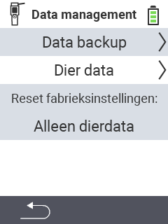

{}
Als u op een menu-item klikt, wordt u doorgestuurd naar een beschrijving van de betreffende functie.
{}

<map name="workmap">
  <area shape="rect" coords="2,40,238,80" alt="Gegevensback-up" title="De instructies voor het maken van een back-up vindt u hier&#10;Muisklik: open documentatie" href="/nl/docs/device/data-management/data-backup/">

  <area shape="rect" coords="2,80,238,120" alt="Dier gegevens" title="De instructies voor het herstellen van een back-up vindt u hier&#10;Muisklik: open documentatie" href="/nl/docs/device/data-management/animal-data/">

  <area shape="rect" coords="2,120,238,200" alt="Reset fabrieksinstellingen" title="Alle informatie en instructies voor het resetten van het apparaat en de diergegevens vindt u hier&#10;Muisklik: open documentatie" href="/nl/docs/reset/">

  <area shape="rect" coords="2,282,120,319" alt="Terug" title="Alle informatie en instructies voor het exporteren van diergegevens vindt u hier&#10;Muisklik: open documentatie" href="/nl/docs/device/">
</map>
