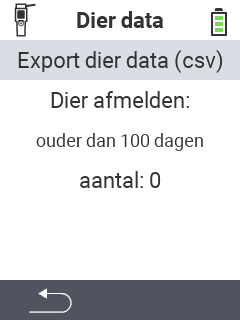

<map name="workmap">
  <area shape="rect" coords="2,40,238,80" alt="Exporteer dierdata (csv)" title="Exporteer uw dierdata&#10;Muisklik: open documentatie" href="/nl/docs/data-export/usb-drive/">

  <area shape="rect" coords="2,80,238,200" alt="dier afmelden" title="Specificeer de leeftijd waarop dieren moeten worden afgemeld&#10;Muisklik: open documentatie" href="/nl/docs/device/data-management/animal-data/unregister-animal/">

  <area shape="rect" coords="2,282,120,319" alt="Terug" title="Alle informatie en instructies voor het exporteren van dierdata vindt u hier&#10;Muisklik: open documentatie" href="/nl/docs/device/data-management/">
</map>
