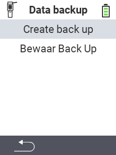

<map name="workmap">
  <area shape="rect" coords="2,40,238,80" alt="Maak back-up" title="De instructies voor het maken van een back-up zijn hier te vinden&#10;Muisklik: open documentatie" href="/nl/docs/backup/backup/">

  <area shape="rect" coords="2,80,238,120" alt="Bewaar Back Up" title="De instructies voor het herstellen van een back-up zijn hier te vinden&#10;Muisklik: open documentatie" href="/nl/docs/backup/restore/">

  <area shape="rect" coords="2,282,120,319" alt="Terug" title="Ga een niveau terug&#10;Muisklik: open documentatie" href="/nl/docs/device/data-management/">
</map>
