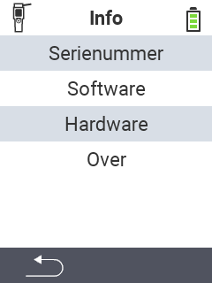

{}
Als u op een menu-item klikt, wordt u doorgestuurd naar een beschrijving van de respectievelijke functie.
{}

<map name="workmap">
  <area shape="rect" coords="2,40,238,80" alt="Serienummer" title="Klik hier om het serienummer van uw apparaat op te halen&#10;Mausklick: zur Dokumentation" href="/nl/docs/device/info/serial-number/">
  <area shape="rect" coords="2,80,238,120" alt="Software" title="De instructies voor het bekijken van uw softwareversie vindt u hier&#10;Mausklick: zur Dokumentation" href="/nl/docs/firmware/versions/">
  <area shape="rect" coords="2,120,238,160" alt="Hardware" title="Klik hier om toegang te krijgen tot de hardware-informatie van uw apparaat&#10;Mausklick: zur Dokumentation" href="/nl/docs/device/info/hardware/">
  <area shape="rect" coords="2,160,238,200" alt="Over" title="Roep leveranciersinformatie op&#10;Mausklick: zur Dokumentation" href="/nl/docs/device/info/about/">

  <area shape="rect" coords="2,282,120,319" alt="Terug" title="Spring een niveau terug&#10;Muisklik: open documentatie" href="/nl/docs/device/">
</map>
