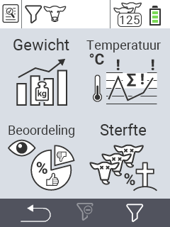

{}
Als u op een menu-item klikt, wordt u doorgestuurd naar een beschrijving van de respectievelijke functie.
{}

<map name="workmap">
  <area shape="rect" coords="3,40,116,160" alt="Gewicht" title="Evalueer uw opgeslagen gegevens in de sectie Gewicht&#10;Muisklik: open documentatie" href="/nl/docs/evaluation/weight/">
  <area shape="rect" coords="3,160,116,279" alt="Beoordeling" title="Evalueer uw opgeslagen gegevens in de beoordelingssectie&#10;Muisklik: open documentatie" href="/nl/docs/evaluation/rating/">

  <area shape="rect" coords="116,40,238,160" alt="Temperatuur" title="Evalueer uw opgeslagen gegevens in de sectie Temperatuur&#10;Muisklik: open documentatie" href="/nl/docs/evaluation/temperature/">
  <area shape="rect" coords="116,160,238,279" alt="Sterfte" title="Evalueer uw opgeslagen gegevens in de sectie Sterfte&#10;Muisklik: open documentatie" href="/nl/docs/evaluation/mortality/">

  <area shape="rect" coords="150,282,238,319" alt="Filter" title="Stel een filter in&#10;Muisklik: naar de documentatie" href="/nl/docs/filter">
  <area shape="rect" coords="2,282,95,319" alt="Terug" title="Spring een niveau terug&#10;Muisklik: naar de documentatie" href="/nl/docs/menu/mainmenu/">
</map>
