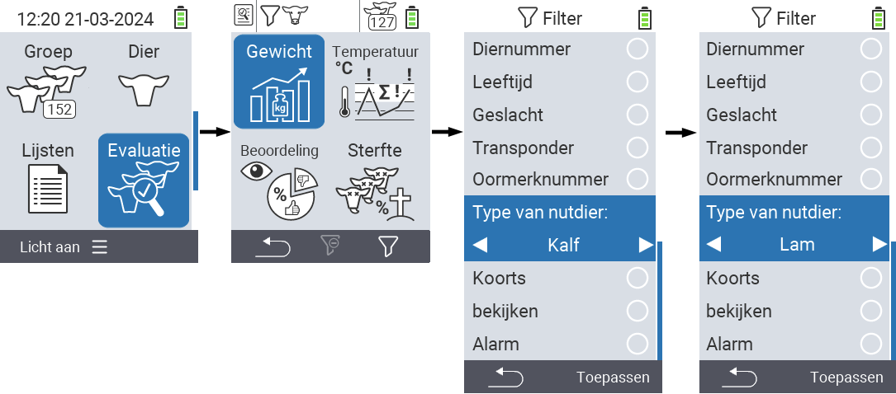
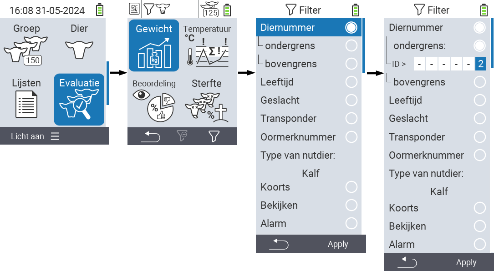
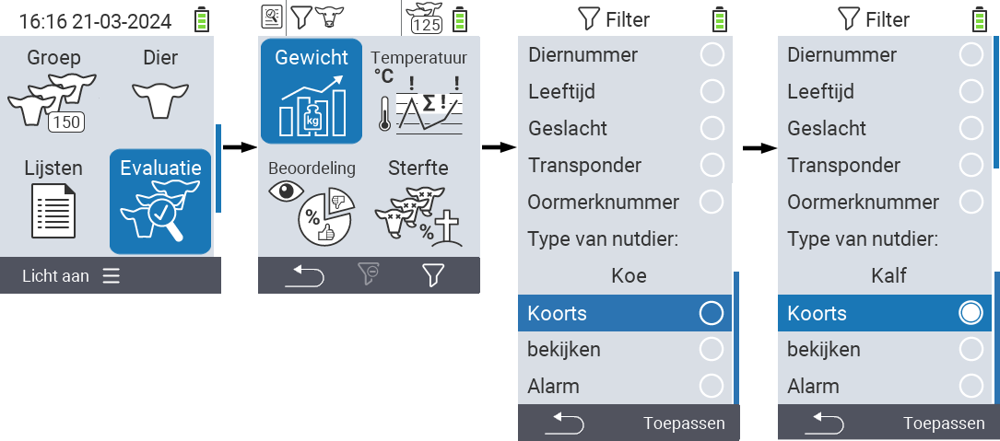

## Filters toepassen

{}
Het filter helpt je om een selectie uit te voeren met filtercriteria binnen de menu-items `Groep`, `Lijsten` en `Evaluatie` van het VitalControl-apparaat. Zodra je een filter toepast, verschijnen er symbolen voor de verschillende filtercriteria bovenaan het scherm. Deze symbolen worden gebruikt om je te helpen ontdekken of en welke filtercriteria zijn geactiveerd. Als je bijvoorbeeld het `Geslacht` filter instelt op mannelijk, zal het apparaat alleen mannelijke dieren gebruiken. Als je bijvoorbeeld ook het `bekijken` filter activeert, gebruikt het apparaat alleen mannelijke dieren die op de observatielijst staan.
{}

Om een filter te creëren in de evaluaties, ga je als volgt te werk:

1. In het submenu dat hoort bij het bovenste menu-item  `Evaluatie` druk je eenmaal op de `F3` toets . In het submenu dat hoort bij de bovenste menu-items  `Lijsten` en  `Groep`, moet je de toets twee keer indrukken.

2. Er opent een submenu waarin je alle filteropties kunt instellen. Je kunt filteren op `Diernummer`, `Leeftijd`, `Geslacht`, `Transponder`, `Oormerknummer`, `Koorts`, `bekijken`, `Type van nutdier` en `Alarm`.

3. Voor de filters `Type van nutdier`, `Geslacht`, `Transponder` en `Oormerknummer` navigeer je naar het overeenkomstige gebied en bevestig je met `OK`. Gebruik de pijltoetsen ◁ ▷ om de gewenste instelling te specificeren. Gebruik de `F3` toets `Toepassen` om de geselecteerde instelling in te stellen. Om je filterwijzigingen te verwerpen, druk je op de `F1` toets &nbsp;&nbsp;.

4. Voor de filters `Diernummer` en `Leeftijd` selecteer het overeenkomstige criterium en bevestig met `OK`. Er worden nu een onder- en bovengrens getoond. Navigeer naar de gewenste grens met de pijltoetsen △ ▽ en bevestig door twee keer op `OK` te drukken. Nu kunt u het gewenste aantal instellen met de pijltoetsen ◁ ▷ en pijltoetsen △ ▽. Als alle instellingen correct zijn, druk opnieuw op `OK` om de instelmodus te verlaten en de geselecteerde filter(s) toe te passen met de `F3` toets `Toepassen`. Met de `F1` toets &nbsp;&nbsp;, kunt u uw wijzigingen desgewenst negeren.

5. Voor de filters `Koorts`, `bekijken` en `Alarm` is er de mogelijkheid om hun toepassing uit te schakelen of in te schakelen. Om dit te doen, selecteer het overeenkomstige filter en bevestig met `OK`. Het filter is nu actief. Bevestig opnieuw met `OK` om het filter te deactiveren.

6. Nadat u alle filters heeft ingesteld, gebruik de `F3` toets `Toepassen` om de gedefinieerde filters in werking te stellen of druk op de `F1` toets  om uw wijzigingen aan de filter(s) te negeren.
