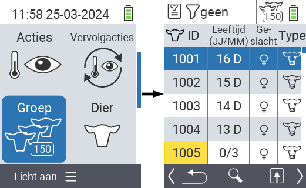
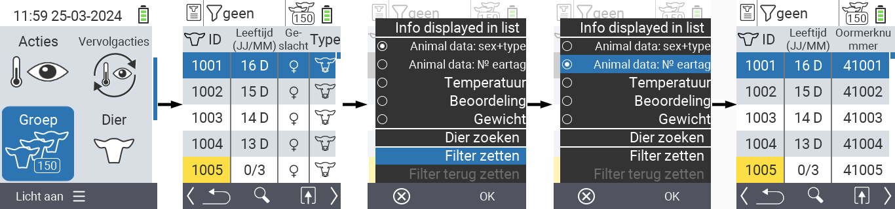
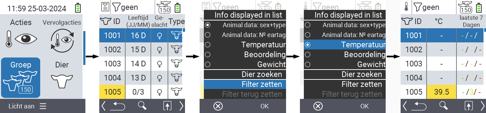
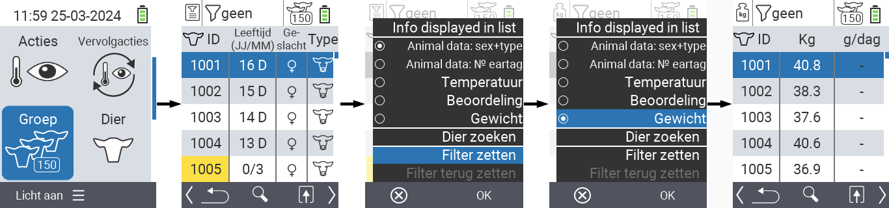
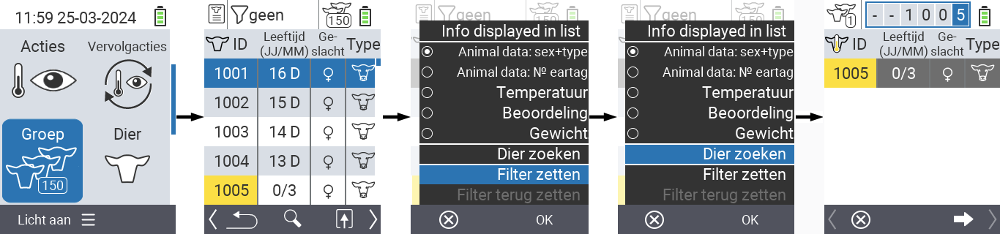
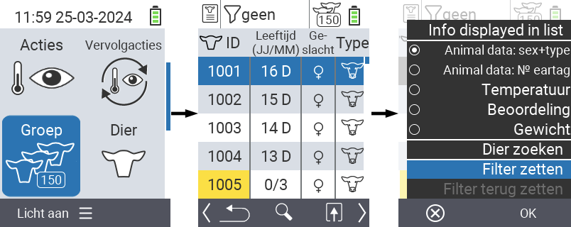
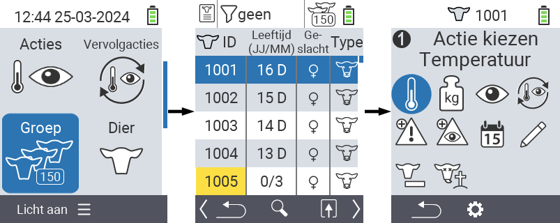

## Kudde {#herd}

Binnen het menu-item Kudde kunt u uw gehele kudde bekijken, individuele dieren zoeken en belangrijke informatie weergeven. U heeft de volgende mogelijkheden:

- Bekijk [diergegevens](#view-animal-data)
- Bekijk [temperatuurgegevens](#display-temperature)
- Bekijk [beoordelingsgegevens](#view-rating)
- Bekijk [gewichtsgegevens](#display-weight)
- [Dier zoeken](#search-animal)
- [Filter instellen](#set-filter)
- [Acties](#call-action-menu)

### Voorbereidende stappen {#preparatory-steps}

1. Selecteer op het hoofdscherm van uw VitalControl-apparaat het menu-item  `Groep` en druk op de `OK` knop.

2. Uw kuddeoverzicht wordt geopend.

    

### Diergegevens bekijken {#view-animal-data}

1. Voltooi de voorbereidende stappen.

2. Gebruik de `F3` toets &nbsp;&nbsp; om een popupmenu op te roepen dat de informatiecategorieën weergeeft die voor de kuddelijst kunnen worden getoond. Gebruik de pijltoetsen △ ▽ om de regel `Diergegevens: geslacht + type` of `Diergegevens: N0 oormerk` te markeren en selecteer deze categorie door op de centrale `OK` knop of de `F3` toets `OK` te drukken. De twee selectieopties verschillen in de weergave van de informatiebalk.

3. Diergegevens worden nu weergegeven als inhoud van de kuddelijst.

4. Als alternatief kunt u de pijltoetsen ◁ ▷ gebruiken om tussen de verschillende weergaveopties te schakelen.

    

{}
Standaard worden de diergegevens eerst weergegeven. Alleen wanneer u bijvoorbeeld het gewicht hebt weergegeven, moet u de weergave van de diergegevens opnieuw instellen.
{}

### Temperatuur weergeven {#display-temperature}

1. Voltooi de voorbereidende stappen.

2. Gebruik de `F3` toets &nbsp;&nbsp; om een pop-upmenu op te roepen dat de informatiecategorieën toont die voor de kudde lijst kunnen worden weergegeven. Gebruik de pijltoetsen △ ▽ om de regel `Temperatuur` te markeren en selecteer deze categorie door op de centrale `OK` knop of de `F3` toets `OK` te drukken.

3. Temperatuurgegevens worden nu weergegeven als inhoud van de kudde lijst.

4. Als alternatief kunt u de pijltoetsen ◁ ▷ gebruiken om tussen de verschillende weergaveopties te schakelen.

    

### Beoordeling bekijken {#view-rating}

1. Voltooi de voorbereidende stappen.

2. Gebruik de `F3` toets &nbsp;&nbsp; om een pop-upmenu op te roepen dat de informatiecategorieën toont die voor de kudde lijst kunnen worden weergegeven. Gebruik de pijltoetsen △ ▽ om de regel `Beoordeling` te markeren en selecteer deze categorie door op de centrale `OK` knop of de `F3` toets `OK` te drukken.

3. Beoordelingsgegevens worden nu weergegeven als inhoud van de kudde lijst.

4. Als alternatief kunt u de pijltoetsen ◁ ▷ gebruiken om tussen de verschillende weergaveopties te schakelen.

    

### Gewicht weergeven {#display-weight}

1. Voltooi de voorbereidende stappen.

2. Gebruik de `F3` toets &nbsp;&nbsp; om een pop-upmenu op te roepen dat de informatiecategorieën toont die voor de kudde lijst kunnen worden weergegeven. Gebruik de pijltoetsen △ ▽ om de regel `Gewicht` te markeren en selecteer deze categorie door op de centrale `OK` knop of de `F3` toets `OK` te drukken.

3. Gewichtsgegevens worden nu weergegeven als inhoud van de kudde lijst.

4. Als alternatief kunt u de pijltoetsen ◁ ▷ gebruiken om tussen de verschillende weergaveopties te schakelen.

    

### Dier zoeken {#search-animal}

1. Voltooi de voorbereidende stappen.

2. Gebruik de `F3` toets &nbsp;&nbsp; om een pop-upmenu op te roepen dat verschillende opties toont. Gebruik de pijltoetsen △ ▽ om de functie `Dier zoeken` te markeren en roep de zoekfunctie op door op de centrale `OK` toets of de `F3` toets `OK` te drukken. Als alternatief kunt u direct na stap één de `Aan/Uit` knop  gebruiken.

3. Gebruik de pijltoetsen △ ▽ ◁ ▷ om het gewenste dier nummer in te voeren en bevestig met `OK`.

    

### Filter instellen {#set-filter}

1. Voltooi de voorbereidende stappen.

2. Gebruik de `F3` toets &nbsp;&nbsp; om een pop-upmenu op te roepen dat verschillende opties weergeeft. Gebruik de pijltoetsen △ ▽ om de functie `Filter instellen` te markeren en roep de filterfunctie op door op de centrale `OK` toets of de `F3` toets `OK` te drukken.

3. Hoe het filter toe te passen is te vinden [hier]().

    

### Actiemenu oproepen {#call-action-menu}

U heeft altijd de mogelijkheid om het actiemenu voor een dier op te roepen.

1. Voltooi de voorbereidende stappen.

2. Selecteer een dier uit de lijst met de pijltoetsen △ ▽ en bevestig met `OK`.

3. Het actiemenu is nu geopend. Hoe dit te gebruiken is te vinden [hier](../acties).

4. Keer terug naar de kuddelijst met de `F3` toets.

    
