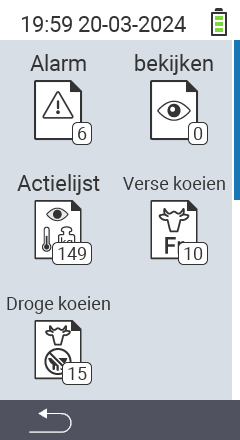

{}
If you click on a menu item, you will be redirected to a description of the respective function.
{}

<map name="workmap">
  <area shape="rect" coords="3,40,116,160" alt="Alarmlijsten" title="Check out your alarm list&#10;Mouse click: open documentation" href="/nl/docs/lists/alarm/">
  <area shape="rect" coords="3,160,116,280" alt="Actienlijst" title="Check out your on action list.&#10;Mouse click: open documentation" href="/nl/docs/lists/actions/">
  <area shape="rect" coords="3,280,116,399" alt="Droge koeien" title="Check out your dry cows list&#10;Mouse click: open documentation" href="/nl/docs/lists/dry-cows/">

  <area shape="rect" coords="116,40,230,160" alt="bekijken" title="Check out your on watch list&#10;Mouse click: open documentation" href="/nl/docs/lists/on-watch/">
  <area shape="rect" coords="116,160,230,280" alt="Verse koeien" title="Check out your fresh cows list&#10;Mouse click: open documentation" href="/nl/docs/lists/verse-koeien/">

  <area shape="rect" coords="2,401,115,438" alt="Back" title="Jump back one level" href="/nl/docs/menu/mainmenu/">
</map>
