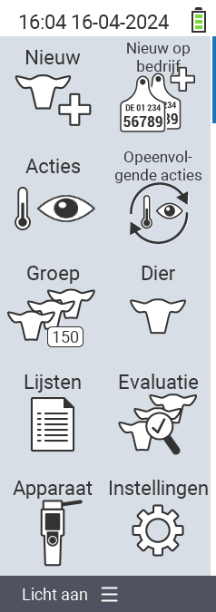

{}
Als u op een menu-item klikt, wordt u doorgestuurd naar een beschrijving van de respectievelijke functie.
{}

<map name="workmap">
  <area shape="rect" coords="3,40,116,160" alt="Nieuw" title="Nieuwe dieren aanmaken&#10;Muisklik: open documentatie" href="/nl/docs/new/">
  <area shape="rect" coords="3,160,116,280" alt="Acties" title="Acties op dieren&#10;Muisklik: open documentatie" href="/nl/docs/acties/">
  <area shape="rect" coords="3,280,116,400" alt="Kudde" title="Kuddemenu&#10;Muisklik: open documentatie" href="/nl/docs/herd/">
  <area shape="rect" coords="3,400,116,520" alt="Lijsten" title="Dierenlijsten&#10;Muisklik: open documentatie" href="/nl/docs/lists/">
  <area shape="rect" coords="3,520,116,634" alt="Apparaat" title="Apparaat&#10;Muisklik: open documentatie" href="/nl/docs/device/">

  <area shape="rect" coords="116,40,230,160" alt="Nieuw op boerderij" title="Toegang van dieren&#10;Muisklik: open documentatie" href="/nl/docs/new-on-farm/">
  <area shape="rect" coords="116,160,230,280" alt="Actieketen" title="Keten van acties&#10;Muisklik: open documentatie" href="/nl/docs/chain-of-actions/">
  <area shape="rect" coords="116,280,230,400" alt="Dier" title="Dier&#10;Muisklik: open documentatie" href="/nl/docs/animal/">
  <area shape="rect" coords="116,400,230,520" alt="Evaluatie" title="Evaluatie&#10;Muisklik: open documentatie" href="/nl/docs/evaluation/">
  <area shape="rect" coords="116,520,230,634" alt="Instellingen" title="Instellingen&#10;Muisklik: open documentatie" href="/nl/docs/settings/">
</map>

