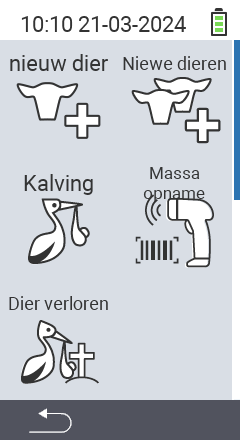

Via het hoofdmenu-item  `Nieuw` kom je in een submenu, waar 5 subitems worden gepresenteerd voor selectie:

<map name="workmap">
  <area shape="rect" coords="3,40,116,160" alt="Nieuw dier" title="Hoe een nieuw dier te registreren met het VitalControl-apparaat&#10;Muisklik: open documentatie" href="/nl/docs/new/animal/">
  <area shape="rect" coords="3,160,116,280" alt="Kalving" title="Hoe een nieuwe kalving te registreren met het VitalControl-apparaat&#10;Muisklik: open documentatie" href="/nl/docs/new/calving/">
  <area shape="rect" coords="3,280,116,399" alt="Dier verloren" title="Hoe het verlies van een dier te registreren met het VitalControl-apparaat&#10;Muisklik: open documentatie" href="/nl/docs/new/animal-loss/">

  <area shape="rect" coords="116,40,230,160" alt="Nieuwe dieren" title="Hoe meerdere nieuwe dieren tegelijk te creëren op het VitalControl-apparaat met één enkele actie&#10;Muisklik: open documentatie" href="/nl/docs/new/animals/">
  <area shape="rect" coords="116,160,230,280" alt="Massa opname" title="Gebruik de barcodescanner om een verscheidenheid aan dieren te registreren&#10;Muisklik: open documentatie" href="/nl/docs/new/bulk-recording/">

  <area shape="rect" coords="1,401,100,439" alt="Terug" title="Spring één niveau terug&#10;Muisklik: naar de documentatie" href="/nl/docs/menu/mainmenu/">
</map>

{}
Elk submenu heeft zijn eigen icoon. Beweeg de muisaanwijzer over een icoon in de grafiek hierboven en laat deze even rusten. Er verschijnt een tooltip met informatie over het geselecteerde submenu. Als je op een van de iconen klikt, word je doorgestuurd naar een beschrijving van het geselecteerde submenu-item.
{}
