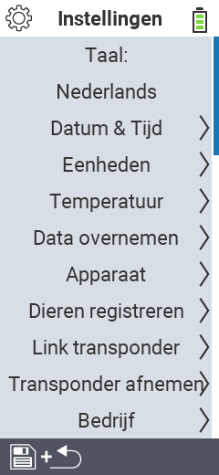

{}
Als u op een menu-item klikt, wordt u doorgestuurd naar een beschrijving van de respectievelijke functie.
{}

<map name="workmap">
  <area shape="rect" coords="2,40,230,120" alt="Taal" title="Stel de taal van de gebruikersinterface in op uw VitalControl-apparaat en sla deze permanent op&#10;Muisklik: open documentatie" href="/nl/docs/settings/language/">
  <area shape="rect" coords="2,120,230,160" alt="Datum & Tijd" title="Hier stelt u de datum en tijd in&#10;Muisklik: open documentatie" href="/nl/docs/settings/datetime/">
  <area shape="rect" coords="2,160,230,200" alt="Eenheden" title="Hier selecteert u eenheden voor temperatuur en massa&#10;Muisklik: open documentatie" href="/nl/docs/settings/units/">
  <area shape="rect" coords="2,200,230,240" alt="Temperatuur" title="Stel de temperatuurinstellingen in voor de toepassing van uw VitalControl-apparaat&#10;Muisklik: open documentatie" href="/nl/docs/settings/temperature/">
   <area shape="rect" coords="2,240,230,280" alt="Data overnemen" title="Hier slaat u relevante informatie op voor de gegevensverzameling van dieren&#10;Muisklik: open documentatie" href="/nl/docs/settings/data-acquisition/">
   <area shape="rect" coords="2,280,230,320" alt="Apparaat" title="Hier kunt u diverse apparaatinstellingen aanpassen&#10;Muisklik: open documentatie" href="/nl/docs/settings/device/">
   <area shape="rect" coords="2,320,230,360" alt="Dieren registreren" title="Hier kunt u verschillende fabrieksinstellingen aanpassen met betrekking tot de registratie van nieuwe dieren naar de eisen van uw boerderij.&#10;Muisklik: open documentatie" href="/nl/docs/settings/animal-registration/">
   <area shape="rect" coords="2,360,230,400" alt="Link transponder" title="Stel de toewijzing van de transponder in op uw VitalControl-apparaat&#10;Muisklik: open documentatie" href="/nl/docs/settings/transponder-linkage/">
   <area shape="rect" coords="2,400,230,439" alt="Transponder afnemen" title="Geef aan hoe de dier-ID wordt toegewezen nadat de transponder is losgemaakt&#10;Muisklik: open documentatie" href="/nl/docs/settings/transponder-linkage/">
   <area shape="rect" coords="2,440,230,480" alt="Bedrijf" title="Sla uw officiële twaalfcijferige nationale boerderij-ID permanent op het VitalControl-apparaat op&#10;Muisklik: open documentatie" href="/nl/docs/settings/farm-number/">
   <area shape="rect" coords="2,482,123,519" alt="Terug" title="Spring één niveau terug" href="/nl/docs/menu/mainmenu/">
</map>
